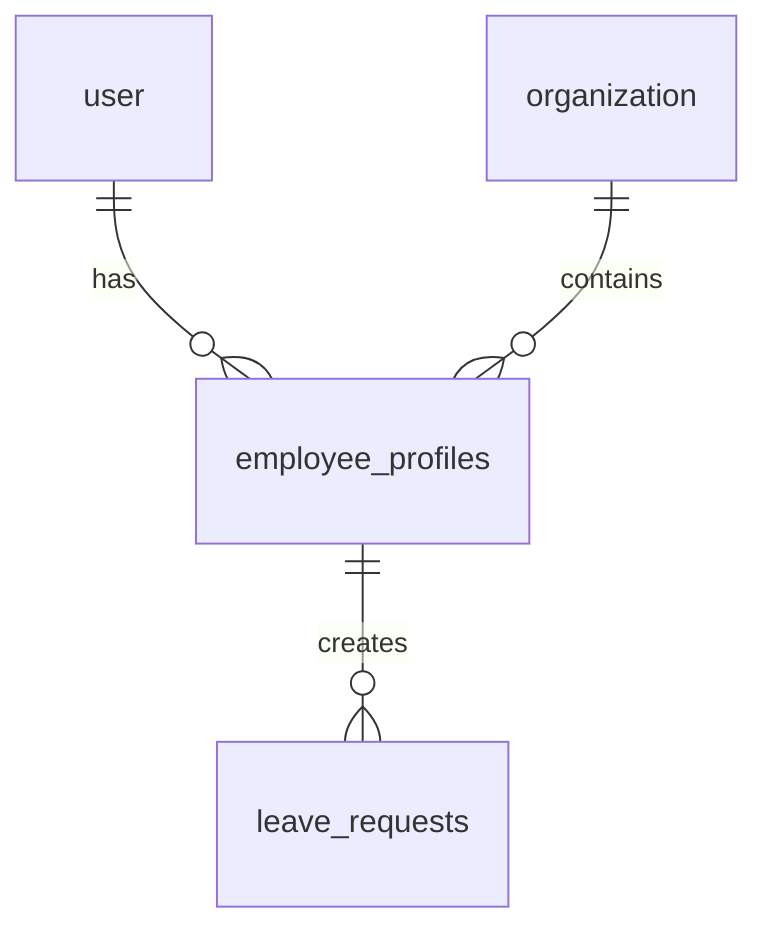

# Torre Tempo V4 - Implementation Checklist
## 12-Week Development Roadmap - Granular Task Breakdown

**Version**: 1.0  
**Created**: February 8, 2026  
**Status**: 🟡 Ready to Start  
**Team**: 2-3 developers + 1 designer + 1 QA

---

## 📊 Progress Overview

| Week | Phase | Tasks | Status | Progress |
|------|-------|-------|--------|----------|
| 1-2  | Foundation & Database | 18 | ⬜ Not Started | 0/18 |
| 3-4  | Time Tracking Enhancement | 22 | ⬜ Not Started | 0/22 |
| 5-6  | Roster Management | 20 | ⬜ Not Started | 0/20 |
| 7-8  | Shift Swaps & Leave | 18 | ⬜ Not Started | 0/18 |
| 9    | Compliance Engine | 15 | ⬜ Not Started | 0/15 |
| 10   | Reporting & Exports | 16 | ⬜ Not Started | 0/16 |
| 11   | Notifications & Polish | 17 | ⬜ Not Started | 0/17 |
| 12   | Testing, Docs, Launch | 14 | ⬜ Not Started | 0/14 |
| **TOTAL** | | **140** | | **0/140** |

---

## Legend

**Status Icons**:
- ⬜ Not Started
- 🟡 In Progress
- ✅ Complete
- ⚠️ Blocked
- ❌ Failed

**Priority**:
- 🔴 Critical Path
- 🟠 High Priority
- 🟡 Medium Priority
- 🟢 Low Priority

---

# WEEK 1-2: FOUNDATION & DATABASE

**Duration**: 10 business days (Feb 10-21, 2026)  
**Focus**: Database schema expansion, encryption layer, seed data  
**Deliverable**: Extended database with encryption ready for feature development

---

## Backend Tasks

### Task 1.1: Create `employee_profiles` Table Schema
**Priority**: 🔴 Critical Path  
**Estimated**: 3 hours  
**Status**: ⬜ Not Started

**Files to create/modify**:
- `apps/api/src/db/schema.ts` (add table definition)
- `packages/shared/src/types/employee.ts` (TypeScript types)

**Dependencies**: None (can start immediately)

**Acceptance Criteria**:
- [ ] Table created with all 24 fields from architecture doc
- [ ] Foreign keys to `user` and `organization` tables
- [ ] 6 encrypted fields use TEXT type: `dni_nie_encrypted`, `social_security_number_encrypted`, `tax_id_encrypted`, `phone_number_encrypted`, `address_encrypted`, `emergency_contact_encrypted`
- [ ] JSONB fields for structured data: `address_encrypted`, `emergency_contact_encrypted`
- [ ] UNIQUE constraint on `(user_id, organization_id)`
- [ ] 2 indexes created: `idx_employee_profiles_org`, `idx_employee_profiles_dni`
- [ ] TypeScript interface exported with correct types

**Verification Commands**:
```bash
cd apps/api
npx drizzle-kit push
psql $DATABASE_URL -c "\d employee_profiles"
```

---

### Task 1.2: Create `leave_requests` Table Schema
**Priority**: 🔴 Critical Path  
**Estimated**: 2 hours  
**Status**: ⬜ Not Started

**Files to create/modify**:
- `apps/api/src/db/schema.ts` (add table definition)
- `packages/shared/src/types/leave.ts` (TypeScript types)

**Dependencies**: None

**Acceptance Criteria**:
- [ ] Table created with all fields from architecture doc
- [ ] Enum type for `leave_type`: vacation, sick, personal, unpaid
- [ ] Enum type for `status`: pending, approved, rejected, cancelled
- [ ] Foreign keys with CASCADE on user deletion
- [ ] 4 indexes: user, org, dates, status
- [ ] Support for half-days (NUMERIC(3,1) for `days_count`)
- [ ] Optional `doctors_note_url` for sick leave
- [ ] TypeScript interface with strict enums

**Verification Commands**:
```bash
npx drizzle-kit push
psql $DATABASE_URL -c "SELECT * FROM leave_requests LIMIT 0"
```

---

### Task 1.3: Create `notifications` Table Schema
**Priority**: 🔴 Critical Path  
**Estimated**: 2 hours  
**Status**: ⬜ Not Started

**Files to create/modify**:
- `apps/api/src/db/schema.ts`
- `packages/shared/src/types/notification.ts`

**Dependencies**: None

**Acceptance Criteria**:
- [ ] Table supports multi-channel delivery (push, email, SMS)
- [ ] `channels` field as TEXT[] array type
- [ ] `action_data` as JSONB for flexible deep links
- [ ] 4 priority levels: urgent, high, normal, low
- [ ] Lifecycle tracking: queued → sent → delivered → read
- [ ] Expiry timestamp support
- [ ] 4 indexes: user, status, scheduled, unread (partial index)
- [ ] TypeScript types for all notification variants

---

### Task 1.4: Create `generated_reports` Table Schema
**Priority**: 🟠 High Priority  
**Estimated**: 2 hours  
**Status**: ⬜ Not Started

**Files to create/modify**:
- `apps/api/src/db/schema.ts`
- `packages/shared/src/types/report.ts`

**Dependencies**: None

**Acceptance Criteria**:
- [ ] Links to `inspector_tokens` for access control
- [ ] Stores SHA-256 hash for integrity verification
- [ ] 4 report types: monthly_timesheet, compliance, variance, inspector
- [ ] 3 access levels: internal, inspector, public
- [ ] Metadata JSONB for flexible report data
- [ ] 3 indexes: org, type, period
- [ ] File path and size tracking

---

### Task 1.5: Create `compliance_checks` Table Schema
**Priority**: 🔴 Critical Path  
**Estimated**: 2 hours  
**Status**: ⬜ Not Started

**Files to create/modify**:
- `apps/api/src/db/schema.ts`
- `packages/shared/src/types/compliance.ts`

**Dependencies**: None

**Acceptance Criteria**:
- [ ] 4 check types: daily_limit, weekly_limit, rest_period, break_required
- [ ] 3 results: pass, warning, violation
- [ ] 4 severity levels: low, medium, high, critical
- [ ] Links to `time_entries` and `shifts` tables
- [ ] Resolution tracking (resolved_at, resolved_by)
- [ ] `rule_reference` field for Spanish law citations
- [ ] Partial index on unresolved checks
- [ ] TypeScript discriminated union types for each check type

---

### Task 1.6: Create `notification_preferences` Table Schema
**Priority**: 🟡 Medium Priority  
**Estimated**: 1.5 hours  
**Status**: ⬜ Not Started

**Files to create/modify**:
- `apps/api/src/db/schema.ts`
- `packages/shared/src/types/notification-preferences.ts`

**Dependencies**: None

**Acceptance Criteria**:
- [ ] One-to-one relationship with `user` table (UNIQUE constraint)
- [ ] DND settings: start_time, end_time, days array
- [ ] `dnd_urgent_override` boolean (allow urgent during DND)
- [ ] Channel preferences per notification type
- [ ] Default values: DND disabled, urgent override enabled
- [ ] Spanish law compliance note in schema comments

---

### Task 1.7: Create `organization_settings` Table Schema
**Priority**: 🟠 High Priority  
**Estimated**: 2 hours  
**Status**: ⬜ Not Started

**Files to create/modify**:
- `apps/api/src/db/schema.ts`
- `packages/shared/src/types/organization-settings.ts`

**Dependencies**: None

**Acceptance Criteria**:
- [ ] Compliance policy fields (max_daily_hours, max_weekly_hours, etc.)
- [ ] Tolerance settings (clock_in_tolerance_minutes)
- [ ] Geofence settings (radius_meters, strict_enforcement)
- [ ] Notification defaults
- [ ] JSONB field for extensible settings
- [ ] Default values match Spanish labor law (9h/day, 40h/week)
- [ ] One-to-one with organization table

---

### Task 1.8: Run Database Migrations
**Priority**: 🔴 Critical Path  
**Estimated**: 1 hour  
**Status**: ⬜ Not Started

**Files to create/modify**:
- `apps/api/drizzle/migrations/*.sql` (auto-generated)

**Dependencies**: Tasks 1.1-1.7 must be complete

**Acceptance Criteria**:
- [ ] `drizzle-kit generate` produces migration files
- [ ] `drizzle-kit push` succeeds without errors
- [ ] All 7 new tables exist in database
- [ ] All indexes created
- [ ] All foreign keys exist with correct CASCADE behavior
- [ ] Run `\dt` and verify 21 total tables (14 existing + 7 new)

**Verification Commands**:
```bash
cd apps/api
npx drizzle-kit generate
npx drizzle-kit push
psql $DATABASE_URL -c "\dt" | wc -l  # Should show 21 tables
```

---

### Task 1.9: Implement Encryption Service
**Priority**: 🔴 Critical Path  
**Estimated**: 4 hours  
**Status**: ⬜ Not Started

**Files to create**:
- `apps/api/src/lib/encryption.ts` (main service)
- `apps/api/src/lib/encryption.test.ts` (unit tests)

**Dependencies**: None

**Acceptance Criteria**:
- [ ] Use Node.js `crypto` module (AES-256-GCM)
- [ ] Key derivation with PBKDF2 (100,000 iterations, SHA-256)
- [ ] Master key from environment variable `ENCRYPTION_KEY`
- [ ] `encrypt(plaintext: string): string` function
- [ ] `decrypt(ciphertext: string): string` function
- [ ] `encryptJSON(data: object): string` function for JSONB fields
- [ ] `decryptJSON<T>(ciphertext: string): T` function
- [ ] Error handling for decryption failures
- [ ] Unit tests: encrypt → decrypt returns original
- [ ] Performance test: <50ms per operation

**Code Structure**:
```typescript
export class EncryptionService {
  private masterKey: Buffer;
  
  constructor(secret: string) { /* derive key */ }
  
  encrypt(plaintext: string): string { /* AES-256-GCM */ }
  decrypt(ciphertext: string): string { /* verify + decrypt */ }
  encryptJSON<T>(data: T): string { /* JSON.stringify + encrypt */ }
  decryptJSON<T>(ciphertext: string): T { /* decrypt + JSON.parse */ }
}

export const encryption = new EncryptionService(process.env.ENCRYPTION_KEY!);
```

---

### Task 1.10: Create Seed Data Script
**Priority**: 🟠 High Priority  
**Estimated**: 3 hours  
**Status**: ⬜ Not Started

**Files to create**:
- `scripts/seed-development-data.ts`

**Dependencies**: Tasks 1.8, 1.9 (database + encryption ready)

**Acceptance Criteria**:
- [ ] Creates 1 test organization: "Demo Restaurant"
- [ ] Creates 10 test users (2 managers, 8 employees)
- [ ] Creates 10 employee profiles with encrypted PII
- [ ] Creates 3 locations with geofencing coordinates
- [ ] Creates 50 shifts across 2 weeks (draft, published, acknowledged)
- [ ] Creates 20 time entries with realistic data
- [ ] Creates 5 swap requests (various statuses)
- [ ] Creates 3 leave requests
- [ ] All data references correct foreign keys
- [ ] Idempotent (can run multiple times safely)

**Usage**:
```bash
cd apps/api
npx tsx ../../scripts/seed-development-data.ts
```

---

### Task 1.11: Create Base CRUD API Routes - Employee Profiles
**Priority**: 🟠 High Priority  
**Estimated**: 3 hours  
**Status**: ⬜ Not Started

**Files to create**:
- `apps/api/src/routes/v1/employee-profiles.ts`
- `apps/api/src/middleware/requireRole.ts` (if not exists)

**Dependencies**: Tasks 1.1, 1.9 (table + encryption)

**Acceptance Criteria**:
- [ ] `GET /api/v1/org/:slug/employees` - List all employees (manager+)
- [ ] `GET /api/v1/org/:slug/employees/:id` - Get one employee (self or manager+)
- [ ] `POST /api/v1/org/:slug/employees` - Create profile (tenantAdmin+)
- [ ] `PATCH /api/v1/org/:slug/employees/:id` - Update profile (tenantAdmin+)
- [ ] All PII fields encrypted before storage
- [ ] RLS enforced (organization_id check)
- [ ] Role-based access control middleware
- [ ] Returns decrypted data to authorized users
- [ ] Validation for required fields
- [ ] Error handling with proper HTTP status codes

**Testing**:
```bash
# Test as manager
curl -H "Authorization: Bearer $MANAGER_TOKEN" \
  http://localhost:3000/api/v1/org/demo-restaurant/employees

# Test unauthorized access
curl -H "Authorization: Bearer $EMPLOYEE_TOKEN" \
  http://localhost:3000/api/v1/org/demo-restaurant/employees/other-user-id
# Should return 403 Forbidden
```

---

### Task 1.12: Create Base CRUD API Routes - Leave Requests
**Priority**: 🟠 High Priority  
**Estimated**: 3 hours  
**Status**: ⬜ Not Started

**Files to create**:
- `apps/api/src/routes/v1/leave-requests.ts`

**Dependencies**: Task 1.2

**Acceptance Criteria**:
- [ ] `GET /api/v1/org/:slug/leave-requests` - List (manager sees all, employee sees own)
- [ ] `POST /api/v1/org/:slug/leave-requests` - Create request (all users)
- [ ] `PATCH /api/v1/org/:slug/leave-requests/:id/approve` - Approve (manager+)
- [ ] `PATCH /api/v1/org/:slug/leave-requests/:id/reject` - Reject (manager+)
- [ ] `DELETE /api/v1/org/:slug/leave-requests/:id` - Cancel (creator only, before approval)
- [ ] Validates date ranges (start < end)
- [ ] Calculates `days_count` automatically (including half-days)
- [ ] Checks leave balance before approval
- [ ] RLS enforcement
- [ ] Returns 400 if dates overlap with existing approved leave

---

### Task 1.13: Create Base CRUD API Routes - Notifications
**Priority**: 🟡 Medium Priority  
**Estimated**: 2 hours  
**Status**: ⬜ Not Started

**Files to create**:
- `apps/api/src/routes/v1/notifications.ts`

**Dependencies**: Task 1.3

**Acceptance Criteria**:
- [ ] `GET /api/v1/org/:slug/notifications` - List user's notifications (paginated)
- [ ] `GET /api/v1/org/:slug/notifications/unread-count` - Get badge count
- [ ] `PATCH /api/v1/org/:slug/notifications/:id/read` - Mark as read
- [ ] `PATCH /api/v1/org/:slug/notifications/read-all` - Mark all as read
- [ ] Returns only current user's notifications
- [ ] Includes action data for deep links
- [ ] Supports query filters: `?status=unread&priority=urgent`
- [ ] Pagination: default 20 per page, max 100

---

### Task 1.14: Create Encryption Unit Tests
**Priority**: 🔴 Critical Path  
**Estimated**: 2 hours  
**Status**: ⬜ Not Started

**Files to create**:
- `apps/api/src/lib/encryption.test.ts`

**Dependencies**: Task 1.9

**Acceptance Criteria**:
- [ ] Test: encrypt → decrypt returns original string
- [ ] Test: encrypt same plaintext twice produces different ciphertexts (IV randomization)
- [ ] Test: decrypt with wrong key throws error
- [ ] Test: decrypt corrupted ciphertext throws error
- [ ] Test: encryptJSON → decryptJSON preserves object structure
- [ ] Test: encryption of 1000 records takes <5 seconds
- [ ] Test: handles unicode characters correctly
- [ ] Test: handles empty strings
- [ ] All tests pass with `npm test`

**Run Tests**:
```bash
cd apps/api
npm test -- encryption.test.ts
```

---

### Task 1.15: Create Integration Tests for New Endpoints
**Priority**: 🟠 High Priority  
**Estimated**: 4 hours  
**Status**: ⬜ Not Started

**Files to create**:
- `apps/api/src/routes/v1/__tests__/employee-profiles.test.ts`
- `apps/api/src/routes/v1/__tests__/leave-requests.test.ts`

**Dependencies**: Tasks 1.11, 1.12

**Acceptance Criteria**:
- [ ] Test employee profile CRUD operations
- [ ] Test leave request workflow (create → approve → reject)
- [ ] Test RLS enforcement (user can't access other org's data)
- [ ] Test role-based access (employee can't approve leave)
- [ ] Test encryption (PII fields are encrypted in DB)
- [ ] Test validation (invalid dates rejected)
- [ ] Mock database with in-memory SQLite or test database
- [ ] All tests pass in CI/CD pipeline

---

### Task 1.16: Performance Testing - Database Load
**Priority**: 🟡 Medium Priority  
**Estimated**: 2 hours  
**Status**: ⬜ Not Started

**Files to create**:
- `scripts/performance-test-db.ts`

**Dependencies**: Tasks 1.8, 1.10 (database + seed data)

**Acceptance Criteria**:
- [ ] Test: Insert 1000 time entries concurrently
- [ ] Test: Query 10,000 time entries with pagination
- [ ] Test: Complex join query (time_entries + employee_profiles + shifts) <500ms
- [ ] Test: Encryption/decryption of 1000 records <5 seconds
- [ ] Test: Compliance check calculation on 500 entries <2 seconds
- [ ] Results logged to console with timing metrics
- [ ] Identifies slow queries (use `EXPLAIN ANALYZE`)

**Run Test**:
```bash
cd apps/api
npx tsx ../../scripts/performance-test-db.ts
```

---

### Task 1.17: Update Shared TypeScript Types
**Priority**: 🔴 Critical Path  
**Estimated**: 2 hours  
**Status**: ⬜ Not Started

**Files to create/modify**:
- `packages/shared/src/types/employee.ts`
- `packages/shared/src/types/leave.ts`
- `packages/shared/src/types/notification.ts`
- `packages/shared/src/types/report.ts`
- `packages/shared/src/types/compliance.ts`
- `packages/shared/src/index.ts` (export all new types)

**Dependencies**: Tasks 1.1-1.7

**Acceptance Criteria**:
- [ ] All database schema types exported as TypeScript interfaces
- [ ] Enums defined as const objects with `as const` assertion
- [ ] Zod schemas for runtime validation (optional but recommended)
- [ ] Discriminated unions for polymorphic types (e.g., notification action types)
- [ ] JSDoc comments for all interfaces
- [ ] No `any` types
- [ ] Compiles without errors: `npm run build --workspace=shared`

---

### Task 1.18: Documentation - Database Schema Diagram
**Priority**: 🟢 Low Priority  
**Estimated**: 2 hours  
**Status**: ⬜ Not Started

**Files to create**:
- `docs/DATABASE_SCHEMA_VISUAL.md`
- `docs/diagrams/database-erd.svg` (optional visual diagram)

**Dependencies**: Task 1.8

**Acceptance Criteria**:
- [ ] Markdown table listing all 21 tables
- [ ] Entity-relationship diagram (Mermaid or SVG)
- [ ] Describes all foreign key relationships
- [ ] Highlights RLS-protected tables
- [ ] Highlights tables with encrypted fields
- [ ] Includes index strategy explanation
- [ ] Links to TORRETEMPO_V4_COMPLETE_SYSTEM_ARCHITECTURE.md

**Example**:


---

## Week 1-2 Deliverables Checklist

- [ ] All 7 new database tables created and migrated
- [ ] Encryption service implemented and tested (<50ms latency)
- [ ] Seed data script creates 10 employees, 50 shifts, 20 time entries
- [ ] Base CRUD APIs for employee profiles, leave requests, notifications
- [ ] All unit tests pass (encryption, validation)
- [ ] All integration tests pass (API endpoints, RLS)
- [ ] Performance test: 1000 concurrent inserts succeed
- [ ] API response time <200ms average
- [ ] Documentation updated

---

# WEEK 3-4: TIME TRACKING ENHANCEMENT

**Duration**: 10 business days (Feb 24 - Mar 7, 2026)  
**Focus**: Complete time tracking workflow with offline support and compliance checks  
**Deliverable**: Production-ready time clock with geofencing, breaks, corrections

---

## Backend Tasks

### Task 2.1: Implement Real-Time Compliance Validation Service
**Priority**: 🔴 Critical Path  
**Estimated**: 5 hours  
**Status**: ⬜ Not Started

**Files to create**:
- `apps/api/src/services/compliance-validator.ts`
- `apps/api/src/services/compliance-validator.test.ts`

**Dependencies**: Task 1.5 (compliance_checks table)

**Acceptance Criteria**:
- [ ] 12 validation rules implemented (see architecture doc Part 4)
  - [ ] Daily hours limit (9h max)
  - [ ] Weekly hours limit (40h regular time)
  - [ ] Rest period between shifts (12h min)
  - [ ] Mandatory break (15min for shifts >6h)
  - [ ] Maximum continuous work (9h without 15min break)
  - [ ] Weekly rest period (35h continuous once per week)
  - [ ] Night work limit (8h max for 20:00-06:00)
  - [ ] Overtime tracking (weekly hours 40-48h)
  - [ ] Maximum absolute weekly (48h including overtime)
  - [ ] Adolescent restrictions (8h/day, 40h/week)
  - [ ] Pregnant worker restrictions (if applicable)
  - [ ] Clock-in geofence validation (50m radius)
- [ ] Each rule returns: `{ pass: boolean, severity: 'low'|'medium'|'high'|'critical', message: string, ruleReference: string }`
- [ ] Spanish law article citations included
- [ ] Service is synchronous (no database I/O, pure calculation)
- [ ] 100% unit test coverage for each rule
- [ ] Handles edge cases (midnight crossing, timezone changes, DST)

**Code Structure**:
```typescript
export interface ComplianceResult {
  pass: boolean;
  severity?: 'low' | 'medium' | 'high' | 'critical';
  message: string;
  ruleReference?: string; // e.g., "Estatuto Art. 34.3"
  recommendedAction?: string;
}

export class ComplianceValidator {
  validateDailyLimit(entries: TimeEntry[]): ComplianceResult { }
  validateWeeklyLimit(entries: TimeEntry[]): ComplianceResult { }
  validateRestPeriod(entries: TimeEntry[]): ComplianceResult { }
  validateMandatoryBreak(entry: TimeEntry, breaks: BreakEntry[]): ComplianceResult { }
  // ... 8 more rules
  
  validateAll(context: ValidationContext): ComplianceResult[] { }
}
```

---

### Task 2.2: Integrate Compliance Checks into Clock-Out Endpoint
**Priority**: 🔴 Critical Path  
**Estimated**: 3 hours  
**Status**: ⬜ Not Started

**Files to modify**:
- `apps/api/src/routes/v1/time-entries.ts`

**Dependencies**: Task 2.1

**Acceptance Criteria**:
- [ ] On `POST /api/v1/org/:slug/time-entries/clock-out`:
  - [ ] Run all 12 compliance checks
  - [ ] Insert results into `compliance_checks` table
  - [ ] If any violations: return 400 with violation details
  - [ ] If warnings only: return 200 with warnings in response
  - [ ] If all pass: return 200 with success
- [ ] Response includes compliance summary: `{ violations: 0, warnings: 2, checks: 12 }`
- [ ] Warnings don't block clock-out, violations do
- [ ] Manager can override violations with `?override=true&reason=...` param
- [ ] Override action logged in audit_log

**Testing**:
```bash
# Test violation (try to clock out after 10 hours)
curl -X POST http://localhost:3000/api/v1/org/demo/time-entries/clock-out \
  -H "Authorization: Bearer $TOKEN" \
  -d '{"timestamp": "2026-02-24T20:00:00Z"}'
# Should return 400 with daily limit violation
```

---

### Task 2.3: Build Break Tracking System
**Priority**: 🔴 Critical Path  
**Estimated**: 4 hours  
**Status**: ⬜ Not Started

**Files to create**:
- `apps/api/src/routes/v1/breaks.ts`

**Dependencies**: None (table already exists from Phase 1)

**Acceptance Criteria**:
- [ ] `POST /api/v1/org/:slug/breaks/start` - Start break
  - [ ] Validates user is currently clocked in
  - [ ] Creates `break_entries` record with `start_time`
  - [ ] Returns break ID
- [ ] `POST /api/v1/org/:slug/breaks/end` - End break
  - [ ] Finds active break for user
  - [ ] Sets `end_time`
  - [ ] Calculates `duration_minutes`
  - [ ] Updates time entry's `break_minutes` total
- [ ] `GET /api/v1/org/:slug/breaks` - List breaks for time entry
- [ ] Prevents starting break when not clocked in (400 error)
- [ ] Prevents multiple concurrent breaks (400 error)
- [ ] Auto-ends break if user clocks out (defensive logic)
- [ ] Tracks paid vs unpaid breaks (`is_paid` field)

---

### Task 2.4: Create Correction Request Workflow API
**Priority**: 🟠 High Priority  
**Estimated**: 4 hours  
**Status**: ⬜ Not Started

**Files to create**:
- `apps/api/src/routes/v1/correction-requests.ts`

**Dependencies**: None (table already exists)

**Acceptance Criteria**:
- [ ] `POST /api/v1/org/:slug/corrections` - Create correction request
  - [ ] Employee submits: time_entry_id, requested_clock_in, requested_clock_out, reason
  - [ ] Status set to 'pending'
  - [ ] Notifies manager
- [ ] `GET /api/v1/org/:slug/corrections` - List corrections (manager sees all, employee sees own)
- [ ] `PATCH /api/v1/org/:slug/corrections/:id/approve` - Manager approves
  - [ ] Updates original time_entry with corrected times
  - [ ] Logs change in audit_log with `previous_hash` reference
  - [ ] Status → 'approved'
  - [ ] Notifies employee
- [ ] `PATCH /api/v1/org/:slug/corrections/:id/reject` - Manager rejects
  - [ ] Status → 'rejected'
  - [ ] Notifies employee with rejection reason
- [ ] Validation: corrected times must be within same day
- [ ] Validation: corrected times must not violate compliance rules

---

### Task 2.5: Implement SHA-256 Audit Chain
**Priority**: 🔴 Critical Path  
**Estimated**: 3 hours  
**Status**: ⬜ Not Started

**Files to modify**:
- `apps/api/src/services/audit.service.ts` (already exists, enhance)

**Dependencies**: None

**Acceptance Criteria**:
- [ ] On every time_entry create/update:
  - [ ] Calculate SHA-256 hash of entry data + previous_hash
  - [ ] Store hash in audit_log.record_hash
  - [ ] Link to previous audit entry via previous_hash
- [ ] Hash input format: `${userId}:${clockIn}:${clockOut}:${breakMinutes}:${previousHash}`
- [ ] Expose verification endpoint: `GET /api/v1/org/:slug/audit/verify/:entryId`
  - [ ] Recalculates hash chain from genesis to target entry
  - [ ] Returns: `{ valid: true/false, chainLength: number, lastHash: string }`
- [ ] Genesis entry (first ever) uses `previousHash = "0000000000000000"`
- [ ] Verification fails if any entry has been tampered
- [ ] Performance: verify 1000-entry chain in <2 seconds

---

### Task 2.6: Build WebSocket Server for Live Attendance
**Priority**: 🟡 Medium Priority  
**Estimated**: 5 hours  
**Status**: ⬜ Not Started

**Files to create**:
- `apps/api/src/lib/websocket.ts`
- `apps/api/src/index.ts` (integrate WebSocket server)

**Dependencies**: None

**Acceptance Criteria**:
- [ ] WebSocket server runs on same port as HTTP server
- [ ] Authentication via JWT token in connection URL: `ws://localhost:3000?token=...`
- [ ] Rooms per organization: clients join room based on org_id
- [ ] Events emitted:
  - [ ] `attendance:clock-in` - When user clocks in
  - [ ] `attendance:clock-out` - When user clocks out
  - [ ] `attendance:break-start` - When break starts
  - [ ] `attendance:break-end` - When break ends
- [ ] Payload includes: userId, userName, timestamp, location
- [ ] Only managers+ receive events (employees don't see peer activity)
- [ ] Graceful disconnect handling
- [ ] Reconnection with exponential backoff on client

**Testing**:
```bash
# Use wscat to test
npm install -g wscat
wscat -c "ws://localhost:3000?token=$MANAGER_TOKEN"
# Should receive live attendance events
```

---

## Frontend Tasks

### Task 2.7: Enhance Clock-In/Out UI Component
**Priority**: 🔴 Critical Path  
**Estimated**: 6 hours  
**Status**: ⬜ Not Started

**Files to modify**:
- `apps/web/src/components/ClockInSheet.tsx`
- `apps/web/src/hooks/useGeolocation.ts` (create)

**Dependencies**: None

**Acceptance Criteria**:
- [ ] Giant clock-in button (min 120px height, full-width on mobile)
- [ ] Real-time clock display (updates every second)
- [ ] Geolocation request on component mount
- [ ] Shows distance to nearest location: "125m from Main Kitchen"
- [ ] Visual feedback:
  - [ ] Green: within 50m (valid)
  - [ ] Yellow: 50-100m (warning)
  - [ ] Red: >100m (invalid, button disabled)
- [ ] Haptic feedback on successful clock-in (navigator.vibrate)
- [ ] Optimistic UI update (instant feedback, sync in background)
- [ ] Shows loading state during API call
- [ ] Error handling: displays specific error message
- [ ] Works offline: queues action locally (Task 2.11)
- [ ] Shows last clock-in time if currently clocked in

---

### Task 2.8: Create Break Timer Component
**Priority**: 🔴 Critical Path  
**Estimated**: 4 hours  
**Status**: ⬜ Not Started

**Files to create**:
- `apps/web/src/components/BreakTimer.tsx`

**Dependencies**: Task 2.3 (break API)

**Acceptance Criteria**:
- [ ] Appears automatically when user is clocked in
- [ ] "Start Break" button (prominent, secondary color)
- [ ] During break:
  - [ ] Live timer display (MM:SS format, updates every second)
  - [ ] Pulsing animation to indicate active break
  - [ ] "End Break" button (green, primary)
- [ ] Tracks break duration locally (uses `useState` + `setInterval`)
- [ ] Syncs to server on end break
- [ ] Supports paid vs unpaid break toggle
- [ ] Shows total break time for current shift
- [ ] Warning if break exceeds 30 minutes (configurable)
- [ ] Auto-save break if user forgets to end (detected on clock-out)

---

### Task 2.9: Build Correction Request Form
**Priority**: 🟠 High Priority  
**Estimated**: 4 hours  
**Status**: ⬜ Not Started

**Files to create**:
- `apps/web/src/components/CorrectionRequestSheet.tsx`
- `apps/web/src/hooks/useCorrectionRequest.ts`

**Dependencies**: Task 2.4 (correction API)

**Acceptance Criteria**:
- [ ] Accessible from time entry row (three-dot menu → "Request Correction")
- [ ] Form fields:
  - [ ] Current clock-in time (read-only, formatted)
  - [ ] Requested clock-in time (datetime picker)
  - [ ] Current clock-out time (read-only)
  - [ ] Requested clock-out time (datetime picker)
  - [ ] Reason (textarea, 500 char max, required)
- [ ] Validation:
  - [ ] New times must be within same day
  - [ ] Reason is required
  - [ ] Shows preview of time difference: "+15 minutes"
- [ ] Submit button disabled during submission
- [ ] Success: Shows toast "Correction requested, manager will review"
- [ ] Error handling with retry option
- [ ] Works offline: queues request

---

### Task 2.10: Implement Offline Queue (IndexedDB)
**Priority**: 🔴 Critical Path  
**Estimated**: 6 hours  
**Status**: ⬜ Not Started

**Files to create**:
- `apps/web/src/lib/offline-queue.ts`
- `apps/web/src/hooks/useOfflineQueue.ts`

**Dependencies**: None

**Acceptance Criteria**:
- [ ] Uses `idb` package for IndexedDB wrapper
- [ ] Schema: `{ id, action, payload, timestamp, retries, status }`
- [ ] Supported actions: 'clock-in', 'clock-out', 'start-break', 'end-break', 'correction-request'
- [ ] Queue logic:
  - [ ] Add action to queue when offline
  - [ ] Listen for online event (`window.addEventListener('online')`)
  - [ ] Process queue in order (FIFO)
  - [ ] Retry failed actions up to 3 times with exponential backoff
  - [ ] Remove successful actions from queue
- [ ] UI indicator:
  - [ ] Shows "Offline Mode" badge in header
  - [ ] Shows sync status: "Syncing 3 actions..."
  - [ ] Shows success: "All actions synced ✓"
- [ ] Handles conflicts: if action fails due to conflict, notify user
- [ ] Expiry: actions older than 7 days are purged
- [ ] Export `useOfflineQueue()` hook for components

**Code Structure**:
```typescript
interface QueuedAction {
  id: string;
  action: 'clock-in' | 'clock-out' | 'start-break' | 'end-break';
  payload: any;
  timestamp: number;
  retries: number;
  status: 'pending' | 'processing' | 'success' | 'failed';
}

export class OfflineQueue {
  async add(action: string, payload: any): Promise<void> { }
  async processQueue(): Promise<void> { }
  async getQueueLength(): Promise<number> { }
  async clearQueue(): Promise<void> { }
}
```

---

### Task 2.11: Add Live Attendance Widget for Managers
**Priority**: 🟡 Medium Priority  
**Estimated**: 5 hours  
**Status**: ⬜ Not Started

**Files to create**:
- `apps/web/src/components/LiveAttendanceWidget.tsx`
- `apps/web/src/hooks/useWebSocket.ts`

**Dependencies**: Task 2.6 (WebSocket server)

**Acceptance Criteria**:
- [ ] Widget appears on manager dashboard
- [ ] Connects to WebSocket on mount
- [ ] Real-time updates (no polling)
- [ ] Display:
  - [ ] "Currently Clocked In: 12"
  - [ ] "On Break: 3"
  - [ ] List of currently working employees (avatar + name + duration)
  - [ ] Live timer for each employee (updates every minute)
- [ ] Color coding:
  - [ ] Green: normal shift
  - [ ] Yellow: approaching overtime (>7.5h)
  - [ ] Red: violation territory (>9h)
- [ ] Click employee → open detailed view
- [ ] Handles reconnection automatically
- [ ] Shows connection status indicator

---

### Task 2.12: Geofencing Validation Logic
**Priority**: 🔴 Critical Path  
**Estimated**: 3 hours  
**Status**: ⬜ Not Started

**Files to create**:
- `apps/web/src/lib/geofence.ts`

**Dependencies**: None

**Acceptance Criteria**:
- [ ] Haversine formula for distance calculation
- [ ] Input: `(userLat, userLon, locationLat, locationLon) => distanceMeters`
- [ ] Accuracy: ±5 meters
- [ ] Handles edge cases: poles, antimeridian, equator
- [ ] Performance: <1ms for calculation
- [ ] Returns: `{ distance: number, withinRadius: boolean, accuracy: number }`
- [ ] Uses browser's `navigator.geolocation.getCurrentPosition({ enableHighAccuracy: true })`
- [ ] Timeout: 10 seconds
- [ ] Fallback: if geolocation fails, allow manual location selection

**Code Structure**:
```typescript
export interface GeofenceResult {
  distance: number; // meters
  withinRadius: boolean;
  accuracy: number; // meters (GPS accuracy)
  timestamp: number;
}

export function checkGeofence(
  userCoords: [number, number],
  locationCoords: [number, number],
  radiusMeters: number = 50
): GeofenceResult { }

export function haversineDistance(lat1: number, lon1: number, lat2: number, lon2: number): number { }
```

---

### Task 2.13: Compliance Violation Display Component
**Priority**: 🟠 High Priority  
**Estimated**: 3 hours  
**Status**: ⬜ Not Started

**Files to create**:
- `apps/web/src/components/ComplianceAlert.tsx`

**Dependencies**: Task 2.2

**Acceptance Criteria**:
- [ ] Shows when clock-out returns compliance violations
- [ ] Modal dialog (can't dismiss without action)
- [ ] Displays:
  - [ ] Violation title: "Daily Hours Limit Exceeded"
  - [ ] Severity badge (color-coded)
  - [ ] Message: "You've worked 9.5 hours today. Spanish law (Art. 34.3) limits daily work to 9 hours."
  - [ ] Recommended action: "Contact your manager for approval."
- [ ] If warning (not violation):
  - [ ] Yellow banner, dismissible
  - [ ] "You're approaching the weekly limit (38/40 hours)"
- [ ] Links to compliance rule explanation
- [ ] For managers: shows override button with reason input

---

## Testing Tasks

### Task 2.14: Test Geofencing Accuracy
**Priority**: 🟠 High Priority  
**Estimated**: 2 hours  
**Status**: ⬜ Not Started

**Files to create**:
- `apps/web/src/lib/__tests__/geofence.test.ts`

**Dependencies**: Task 2.12

**Acceptance Criteria**:
- [ ] Test: Known coordinates (Madrid Puerta del Sol to Plaza Mayor = 574m)
- [ ] Test: Very close points (5m apart)
- [ ] Test: Same point (0m distance)
- [ ] Test: Antimeridian crossing (180° longitude)
- [ ] Test: North/South poles
- [ ] All calculations within ±5m of expected value
- [ ] Performance: 1000 calculations in <100ms

---

### Task 2.15: Test Offline Mode - Queue 10 Actions
**Priority**: 🔴 Critical Path  
**Estimated**: 3 hours  
**Status**: ⬜ Not Started

**Files to create**:
- `apps/web/src/lib/__tests__/offline-queue.test.ts`

**Dependencies**: Task 2.10

**Acceptance Criteria**:
- [ ] Test: Add 10 actions to queue while offline
- [ ] Test: Switch to online, verify all 10 process successfully
- [ ] Test: If action 5 fails, retry up to 3 times
- [ ] Test: Queue persists across page reloads (IndexedDB)
- [ ] Test: Old actions (>7 days) are purged
- [ ] Test: Concurrent queue processing doesn't duplicate actions
- [ ] Manual test: Turn off network, clock in/out, turn on network, verify sync

**Manual Testing Steps**:
1. Open DevTools → Network tab → Go offline
2. Clock in (should queue locally)
3. Start break (should queue)
4. End break (should queue)
5. Clock out (should queue)
6. Go online
7. Verify: All 4 actions sync within 10 seconds
8. Check API: Verify all 4 entries exist in database

---

### Task 2.16: Test Compliance Rules - Try to Violate Each Rule
**Priority**: 🔴 Critical Path  
**Estimated**: 4 hours  
**Status**: ⬜ Not Started

**Files to create**:
- `apps/api/src/services/__tests__/compliance-validator.test.ts`

**Dependencies**: Task 2.1

**Acceptance Criteria**:
- [ ] Test each of 12 compliance rules:
  - [ ] Daily limit: Clock in 08:00, try to clock out 18:00 (10h) → blocked
  - [ ] Weekly limit: Work 41 hours, try to add more → blocked
  - [ ] Rest period: Clock out 22:00, try to clock in next day 06:00 (8h rest) → blocked
  - [ ] Mandatory break: Work 6.5h without break → warning
  - [ ] Continuous work: Work 9.5h without 15min break → violation
  - [ ] Weekly rest: Work 7 days straight → violation
  - [ ] Night work: Work 20:00-06:00 for 9h → blocked
  - [ ] Overtime: Work 45h in week → warning (allowed but tracked)
  - [ ] Absolute weekly max: Try to work 49h → blocked
  - [ ] Geofence: Clock in 200m away → blocked
  - [ ] Adolescent: If user under 18, work 9h → blocked
  - [ ] Pregnant: If user marked pregnant, night shift → blocked (requires manual flag)
- [ ] All violations return correct severity and Spanish law reference
- [ ] 100% test coverage for compliance-validator.ts

---

### Task 2.17: Load Test - 100 Concurrent Clock-Ins
**Priority**: 🟡 Medium Priority  
**Estimated**: 2 hours  
**Status**: ⬜ Not Started

**Files to create**:
- `scripts/load-test-clock-in.ts`

**Dependencies**: Tasks 2.1, 2.2

**Acceptance Criteria**:
- [ ] Simulates 100 users clocking in simultaneously
- [ ] Uses `autocannon` or `k6` for load testing
- [ ] Metrics:
  - [ ] 95th percentile response time <500ms
  - [ ] 0 errors
  - [ ] 0 database deadlocks
  - [ ] WebSocket broadcasts delivered within 2 seconds
- [ ] Test with compliance checks enabled
- [ ] Test with geofencing enabled
- [ ] Database connection pool handles load (max 20 connections)

**Run Test**:
```bash
npx tsx scripts/load-test-clock-in.ts
```

---

### Task 2.18: Integration Test - Complete Time Tracking Flow
**Priority**: 🔴 Critical Path  
**Estimated**: 3 hours  
**Status**: ⬜ Not Started

**Files to create**:
- `apps/api/src/routes/v1/__tests__/time-tracking-flow.test.ts`

**Dependencies**: Tasks 2.1-2.5

**Acceptance Criteria**:
- [ ] Test complete flow:
  1. User clocks in (geofence valid, within tolerance)
  2. System validates (no violations)
  3. User starts break after 4 hours
  4. User ends break after 20 minutes
  5. User works 2 more hours
  6. User clocks out
  7. System runs compliance checks (all pass)
  8. Audit log entry created with SHA-256 hash
  9. Manager receives notification
- [ ] Test failure scenarios:
  - [ ] Clock in outside geofence → 400 error
  - [ ] Clock out without mandatory break → warning
  - [ ] Clock out after 10 hours → violation
- [ ] All database transactions succeed
- [ ] All WebSocket events emitted

---

### Task 2.19: Manual Testing Checklist
**Priority**: 🟠 High Priority  
**Estimated**: 3 hours  
**Status**: ⬜ Not Started

**Dependencies**: All frontend and backend tasks complete

**Acceptance Criteria**:
- [ ] Manual test on iOS device (iPhone 12+, iOS 16+)
- [ ] Manual test on Android device (Samsung/Pixel, Android 12+)
- [ ] Test offline mode:
  - [ ] Airplane mode, clock in, go online, verify sync
- [ ] Test geofencing:
  - [ ] Clock in at location (should work)
  - [ ] Clock in 200m away (should fail)
- [ ] Test break flow:
  - [ ] Start break, end break, verify duration correct
- [ ] Test compliance violation:
  - [ ] Work 9.5 hours, try to clock out, verify blocked
- [ ] Test correction request:
  - [ ] Create request, manager approves, verify time entry updated
- [ ] Test live attendance widget:
  - [ ] As manager, see real-time updates when employee clocks in
- [ ] Test haptic feedback (vibration on clock-in)
- [ ] Test loading states and error messages
- [ ] Document any bugs in GitHub issues

---

### Task 2.20: Performance Optimization - IndexedDB Queries
**Priority**: 🟡 Medium Priority  
**Estimated**: 2 hours  
**Status**: ⬜ Not Started

**Files to modify**:
- `apps/web/src/lib/offline-queue.ts`

**Dependencies**: Task 2.10

**Acceptance Criteria**:
- [ ] Index on `status` field for fast filtering
- [ ] Index on `timestamp` for chronological sorting
- [ ] Batch operations: process queue in batches of 10
- [ ] Debounce queue processing (wait 2 seconds after online before processing)
- [ ] Measure: `getQueueLength()` takes <10ms
- [ ] Measure: `processQueue()` for 100 items takes <30 seconds

---

### Task 2.21: Update API Documentation
**Priority**: 🟢 Low Priority  
**Estimated**: 2 hours  
**Status**: ⬜ Not Started

**Files to create/modify**:
- `docs/API_ENDPOINTS.md`

**Dependencies**: Tasks 2.3, 2.4

**Acceptance Criteria**:
- [ ] Document all new endpoints:
  - [ ] Break endpoints (start, end, list)
  - [ ] Correction endpoints (create, list, approve, reject)
  - [ ] Compliance validation endpoint
  - [ ] Audit verification endpoint
- [ ] Include request/response examples
- [ ] Include error codes and messages
- [ ] Include authentication requirements
- [ ] Include rate limits (if any)

---

### Task 2.22: Create Demo Video - Time Tracking Flow
**Priority**: 🟢 Low Priority  
**Estimated**: 2 hours  
**Status**: ⬜ Not Started

**Files to create**:
- `docs/demo-videos/time-tracking-flow.mp4`

**Dependencies**: All frontend tasks complete

**Acceptance Criteria**:
- [ ] Record 2-minute video showing:
  1. Employee opens app
  2. Sees clock-in screen
  3. Geofencing validates location
  4. Taps clock-in (haptic feedback)
  5. Works for a bit
  6. Starts break
  7. Ends break
  8. Clocks out
  9. Compliance check runs
  10. Timesheet updates
- [ ] Upload to docs/ or YouTube (unlisted)
- [ ] Embed link in README.md

---

## Week 3-4 Deliverables Checklist

- [ ] Real-time compliance validation (12 rules implemented)
- [ ] Break tracking system (start, end, duration calculation)
- [ ] Correction request workflow (create, approve, reject)
- [ ] SHA-256 audit chain (hash verification working)
- [ ] WebSocket server for live attendance
- [ ] Enhanced clock-in/out UI (geofencing, haptic feedback)
- [ ] Break timer component (live countdown)
- [ ] Correction request form (datetime picker, reason)
- [ ] Offline queue (IndexedDB, sync on reconnect)
- [ ] Live attendance widget for managers (real-time updates)
- [ ] All 12 compliance rules tested and passing
- [ ] Offline mode tested (10 actions queued and synced)
- [ ] Load test: 100 concurrent clock-ins <500ms
- [ ] Manual testing complete on iOS and Android

---

# WEEK 5-6: ROSTER MANAGEMENT

**Duration**: 10 business days (Mar 10-21, 2026)  
**Focus**: Drag-and-drop roster builder with real-time compliance validation  
**Deliverable**: Production-ready roster management system

---

## Frontend Tasks

### Task 3.1: Build Roster Calendar Grid Component
**Priority**: 🔴 Critical Path  
**Estimated**: 8 hours  
**Status**: ⬜ Not Started

**Files to create**:
- `apps/web/src/components/roster/RosterGrid.tsx`
- `apps/web/src/components/roster/RosterCell.tsx`
- `apps/web/src/components/roster/ShiftCard.tsx`

**Dependencies**: None

**Acceptance Criteria**:
- [ ] 7-column grid (Monday-Sunday)
- [ ] Multiple rows per day (stacked shifts)
- [ ] Time slots: 00:00-23:59 (configurable granularity)
- [ ] Responsive: horizontal scroll on mobile, full view on desktop
- [ ] Visual design:
  - [ ] Each shift is a colored card
  - [ ] Shows: employee name, time range, duration, location
  - [ ] Color-coded by location or shift type
  - [ ] Hover state: shows more details (break time, notes)
- [ ] Empty state: "Drag employees here to create shift"
- [ ] Week navigation: previous/next week buttons
- [ ] Week picker: jump to specific week
- [ ] Performance: renders 100-shift week in <500ms

**Libraries**:
- `@dnd-kit/core` for drag-and-drop
- `date-fns` for date manipulation

---

### Task 3.2: Implement Drag-and-Drop Functionality
**Priority**: 🔴 Critical Path  
**Estimated**: 6 hours  
**Status**: ⬜ Not Started

**Files to modify**:
- `apps/web/src/components/roster/RosterGrid.tsx`

**Dependencies**: Task 3.1

**Acceptance Criteria**:
- [ ] Drag sources:
  - [ ] Employee card from sidebar
  - [ ] Existing shift (to reschedule)
- [ ] Drop targets:
  - [ ] Any cell in roster grid
  - [ ] Another shift (to swap)
- [ ] Drag preview: shows employee name + time range
- [ ] Drop validation:
  - [ ] Red outline: conflict detected
  - [ ] Yellow outline: warning (approaching limits)
  - [ ] Green outline: valid drop
- [ ] On drop:
  - [ ] Creates new shift (if dragging from sidebar)
  - [ ] Updates existing shift (if rescheduling)
  - [ ] Shows shift creation modal for time details
- [ ] Accessibility: keyboard navigation (arrow keys to move)
- [ ] Mobile: long-press to drag (500ms delay)

---

### Task 3.3: Add Real-Time Validation Visual Feedback
**Priority**: 🔴 Critical Path  
**Estimated**: 4 hours  
**Status**: ⬜ Not Started

**Files to create**:
- `apps/web/src/components/roster/ValidationIndicator.tsx`
- `apps/web/src/hooks/useRosterValidation.ts`

**Dependencies**: Task 3.2, Backend Task 3.9

**Acceptance Criteria**:
- [ ] On hover over drop target, send validation request to API
- [ ] API returns: `{ valid: boolean, violations: [], warnings: [] }`
- [ ] Visual indicators:
  - [ ] Green checkmark: all rules pass
  - [ ] Yellow warning icon: warnings present (hover for details)
  - [ ] Red X icon: violations present (drop disabled)
- [ ] Tooltip shows specific issues:
  - [ ] "This shift would exceed María's 40h weekly limit"
  - [ ] "Only 10h rest since last shift (12h required)"
- [ ] Debounce validation requests (300ms)
- [ ] Caches validation results (5 minutes TTL)
- [ ] Shows loading spinner during validation

---

### Task 3.4: Create Shift Creation Modal
**Priority**: 🔴 Critical Path  
**Estimated**: 5 hours  
**Status**: ⬜ Not Started

**Files to create**:
- `apps/web/src/components/roster/ShiftCreationModal.tsx`

**Dependencies**: None

**Acceptance Criteria**:
- [ ] Opens when employee is dropped on roster grid
- [ ] Pre-filled:
  - [ ] Employee (read-only)
  - [ ] Date (from drop target)
  - [ ] Default time range (e.g., 09:00-17:00)
- [ ] Editable fields:
  - [ ] Start time (datetime picker)
  - [ ] End time (datetime picker)
  - [ ] Location (dropdown)
  - [ ] Break minutes (number input, default 30)
  - [ ] Notes (textarea, optional)
  - [ ] Shift type (select: regular, opening, closing, split)
- [ ] Calculated fields (auto-update):
  - [ ] Duration (e.g., "8h 30m")
  - [ ] Total hours (excluding break)
- [ ] Validation:
  - [ ] End time > start time
  - [ ] Duration max 12 hours
  - [ ] Runs compliance check on save
- [ ] Buttons: Save (primary), Cancel (secondary)
- [ ] On save: POST to API, close modal, refresh grid

---

### Task 3.5: Build Roster Publishing Confirmation Dialog
**Priority**: 🟠 High Priority  
**Estimated**: 3 hours  
**Status**: ⬜ Not Started

**Files to create**:
- `apps/web/src/components/roster/PublishDialog.tsx`

**Dependencies**: Backend Task 3.10

**Acceptance Criteria**:
- [ ] Triggered by "Publish Roster" button in header
- [ ] Shows summary:
  - [ ] Total shifts: 42
  - [ ] Employees scheduled: 8
  - [ ] Total hours: 336
  - [ ] Compliance status: ✅ All checks passed
- [ ] Warning if violations exist: "3 shifts have warnings. Review before publishing."
- [ ] Checkbox: "I confirm all shifts are reviewed and approved"
- [ ] On confirm:
  - [ ] Bulk update shifts: `draft` → `published`
  - [ ] Send notifications to all scheduled employees
  - [ ] Show success toast: "Roster published. 8 employees notified."
- [ ] Can't unpublish (one-way operation)
- [ ] Logs action in audit_log

---

### Task 3.6: Implement Employee Sidebar
**Priority**: 🟠 High Priority  
**Estimated**: 4 hours  
**Status**: ⬜ Not Started

**Files to create**:
- `apps/web/src/components/roster/EmployeeSidebar.tsx`
- `apps/web/src/components/roster/EmployeeCard.tsx`

**Dependencies**: None

**Acceptance Criteria**:
- [ ] Left sidebar (collapsible on mobile)
- [ ] Lists all active employees in organization
- [ ] Each card shows:
  - [ ] Avatar + name
  - [ ] Weekly hours so far: "24 / 40 hours"
  - [ ] Availability indicator: 🟢 Available, 🔴 Unavailable
  - [ ] Skills/qualifications badges
- [ ] Draggable cards (use @dnd-kit)
- [ ] Search/filter:
  - [ ] By name
  - [ ] By availability
  - [ ] By skill
  - [ ] By location
- [ ] Sort options: name, hours worked, availability
- [ ] Color-coded by status:
  - [ ] Green: under 30h (available)
  - [ ] Yellow: 30-40h (approaching limit)
  - [ ] Red: 40h+ (at limit, drag disabled)

---

## Backend Tasks

### Task 3.7: Create Shift Creation Modal Time Picker
**Priority**: 🟠 High Priority  
**Estimated**: 3 hours  
**Status**: ⬜ Not Started

**Files to create**:
- `apps/web/src/components/roster/TimePicker.tsx`

**Dependencies**: None

**Acceptance Criteria**:
- [ ] 24-hour format (Spanish standard)
- [ ] 15-minute granularity (00:00, 00:15, 00:30, 00:45)
- [ ] Dropdown or slider interface
- [ ] Validates: no invalid times (e.g., 25:00)
- [ ] Handles midnight crossing (end time next day)
- [ ] Accessible: keyboard input (type "14:30")
- [ ] Mobile-optimized: native time picker on iOS/Android

---

### Task 3.8: Build Roster Templates System
**Priority**: 🟡 Medium Priority  
**Estimated**: 5 hours  
**Status**: ⬜ Not Started

**Files to create**:
- `apps/web/src/components/roster/TemplateSelector.tsx`
- `apps/api/src/routes/v1/roster-templates.ts`

**Dependencies**: None

**Acceptance Criteria**:
- [ ] Backend:
  - [ ] `GET /api/v1/org/:slug/roster-templates` - List templates
  - [ ] `POST /api/v1/org/:slug/roster-templates` - Save current roster as template
  - [ ] `POST /api/v1/org/:slug/roster-templates/:id/apply` - Apply template to week
- [ ] Frontend:
  - [ ] Dropdown in roster header: "Load Template"
  - [ ] Options: "Last Week", "2 Weeks Ago", custom saved templates
  - [ ] On select: loads shifts into grid (doesn't save yet)
  - [ ] "Save as Template" button: prompts for name, saves
- [ ] Template data:
  - [ ] Stores shifts without specific dates (e.g., "Monday 09:00-17:00")
  - [ ] When applied, maps to selected week
- [ ] Use case: Restaurant has same schedule every week, save as "Standard Week"

---

### Task 3.9: Implement Roster Validation API
**Priority**: 🔴 Critical Path  
**Estimated**: 5 hours  
**Status**: ⬜ Not Started

**Files to create**:
- `apps/api/src/routes/v1/roster-validation.ts`
- `apps/api/src/services/roster-validator.ts`

**Dependencies**: Week 3-4 compliance validator

**Acceptance Criteria**:
- [ ] Endpoint: `POST /api/v1/org/:slug/roster/validate`
- [ ] Input: `{ userId, shiftData: { start, end, locationId } }`
- [ ] Validates:
  - [ ] Daily hours limit (9h)
  - [ ] Weekly hours limit (40h)
  - [ ] Rest period since last shift (12h min)
  - [ ] Availability match (user marked available for this time?)
  - [ ] Location assignment (user assigned to this location?)
  - [ ] Skill requirements (shift requires skill X, user has skill X?)
  - [ ] No double-booking (user already has shift at this time?)
- [ ] Returns:
  ```json
  {
    "valid": false,
    "violations": [
      {
        "rule": "weekly_limit",
        "message": "This shift would bring weekly total to 41 hours (40h max)",
        "severity": "high"
      }
    ],
    "warnings": [
      {
        "rule": "approaching_overtime",
        "message": "User will have 38 hours after this shift",
        "severity": "low"
      }
    ]
  }
  ```
- [ ] Performance: <100ms response time
- [ ] Caching: cache user's weekly hours (invalidate on shift change)

---

### Task 3.10: Build Roster Publishing Endpoint
**Priority**: 🔴 Critical Path  
**Estimated**: 4 hours  
**Status**: ⬜ Not Started

**Files to create**:
- `apps/api/src/routes/v1/roster.ts` (modify existing)

**Dependencies**: None

**Acceptance Criteria**:
- [ ] Endpoint: `POST /api/v1/org/:slug/roster/publish`
- [ ] Input: `{ weekStart: "2026-03-10", weekEnd: "2026-03-16" }`
- [ ] Logic:
  - [ ] Find all shifts in date range with status `draft`
  - [ ] Run final compliance validation on all shifts
  - [ ] If any violations: return 400 with list
  - [ ] If all pass:
    1. Update all shifts: `status = 'published'`, `published_at = NOW()`
    2. Create notification for each scheduled employee
    3. Queue notifications in BullMQ
    4. Log action in audit_log
    5. Return success
- [ ] Transaction: all-or-nothing (atomic)
- [ ] Idempotent: publishing twice does nothing
- [ ] Sends notification: "Your schedule for week of Mar 10 is available"

---

### Task 3.11: Create Shift Duplication Endpoint
**Priority**: 🟡 Medium Priority  
**Estimated**: 3 hours  
**Status**: ⬜ Not Started

**Files to create**:
- `apps/api/src/routes/v1/roster.ts` (modify)

**Dependencies**: None

**Acceptance Criteria**:
- [ ] Endpoint: `POST /api/v1/org/:slug/roster/duplicate`
- [ ] Input: `{ sourceWeekStart: "2026-03-03", targetWeekStart: "2026-03-10" }`
- [ ] Logic:
  - [ ] Fetch all shifts from source week
  - [ ] For each shift:
    1. Create new shift with same times, employee, location
    2. Adjust dates by +7 days
    3. Set status to `draft`
    4. Run validation
    5. If validation fails: skip shift, add to warning list
  - [ ] Return: `{ created: 42, skipped: 3, warnings: [...] }`
- [ ] Use case: Manager copies last week's roster, makes adjustments, publishes

---

### Task 3.12: Implement Shift CRUD Endpoints
**Priority**: 🟠 High Priority  
**Estimated**: 4 hours  
**Status**: ⬜ Not Started

**Files to modify**:
- `apps/api/src/routes/v1/shifts.ts` (already exists, enhance)

**Dependencies**: None

**Acceptance Criteria**:
- [ ] `POST /api/v1/org/:slug/shifts` - Create shift (manager+)
  - [ ] Validates times, employee assignment
  - [ ] Runs compliance check
  - [ ] Returns 400 if violations
  - [ ] Status defaults to `draft`
- [ ] `PATCH /api/v1/org/:slug/shifts/:id` - Update shift (manager+)
  - [ ] Only draft shifts can be edited
  - [ ] Published shifts require correction request workflow
- [ ] `DELETE /api/v1/org/:slug/shifts/:id` - Delete shift (manager+)
  - [ ] Only draft shifts can be deleted
  - [ ] If published: must cancel instead (updates status, sends notification)
- [ ] All operations logged in audit_log
- [ ] RLS enforcement (organization_id check)

---

## Testing Tasks

### Task 3.13: Test All Compliance Scenarios
**Priority**: 🔴 Critical Path  
**Estimated**: 4 hours  
**Status**: ⬜ Not Started

**Files to create**:
- `apps/api/src/services/__tests__/roster-validator.test.ts`

**Dependencies**: Task 3.9

**Acceptance Criteria**:
- [ ] Test: Assign shift that exceeds weekly limit → blocked
- [ ] Test: Assign shift with only 8h rest since last shift → blocked
- [ ] Test: Assign shift when user marked unavailable → warning
- [ ] Test: Assign shift to user without required skill → warning
- [ ] Test: Double-book user → blocked
- [ ] Test: Valid shift → passes all checks
- [ ] Test: Shift with 38h weekly → warning (approaching limit)
- [ ] Test: Night shift (20:00-06:00) max 8h → enforced
- [ ] All tests pass with correct severity levels

---

### Task 3.14: Performance Test - Create 100-Shift Roster
**Priority**: 🟡 Medium Priority  
**Estimated**: 2 hours  
**Status**: ⬜ Not Started

**Files to create**:
- `scripts/performance-test-roster.ts`

**Dependencies**: Backend tasks complete

**Acceptance Criteria**:
- [ ] Create 100 shifts for 20 employees across 1 week
- [ ] Measure: total time <2 seconds
- [ ] Measure: validation time per shift <100ms
- [ ] Measure: publish operation (bulk update 100 rows) <1 second
- [ ] Measure: notification queue (100 notifications) <5 seconds
- [ ] Database: no deadlocks, no constraint violations

---

### Task 3.15: Test Notification Delivery - 8 Employees
**Priority**: 🟠 High Priority  
**Estimated**: 2 hours  
**Status**: ⬜ Not Started

**Dependencies**: Task 3.10

**Acceptance Criteria**:
- [ ] Publish roster with 8 employees
- [ ] Verify: All 8 receive push notification within 30 seconds
- [ ] Verify: Notification content correct (week dates, shift count)
- [ ] Verify: Deep link opens roster view for that week
- [ ] Verify: If push fails, fallback to email
- [ ] Manual test: Check notification on iOS and Android devices

---

### Task 3.16: Manual Testing - Drag-and-Drop UX
**Priority**: 🟠 High Priority  
**Estimated**: 3 hours  
**Status**: ⬜ Not Started

**Dependencies**: All frontend tasks complete

**Acceptance Criteria**:
- [ ] Test on desktop (Chrome, Firefox, Safari)
- [ ] Test on mobile (iOS, Android)
- [ ] Scenarios:
  - [ ] Drag employee from sidebar to Monday 09:00 → creates shift
  - [ ] Drag existing shift to Tuesday → reschedules
  - [ ] Drag shift over employee at limit → shows red outline
  - [ ] Drop shift on same employee different day → works
  - [ ] Multi-select shifts (Cmd/Ctrl click) → bulk operations
- [ ] Verify: drag preview visible
- [ ] Verify: validation indicators show instantly
- [ ] Verify: no UI glitches (flickering, misalignment)
- [ ] Verify: works with 50+ shifts on screen

---

### Task 3.17: Accessibility Testing - Keyboard Navigation
**Priority**: 🟡 Medium Priority  
**Estimated**: 2 hours  
**Status**: ⬜ Not Started

**Dependencies**: Frontend tasks complete

**Acceptance Criteria**:
- [ ] Tab navigation: Can focus all interactive elements
- [ ] Arrow keys: Navigate between roster cells
- [ ] Enter: Opens shift creation modal when cell focused
- [ ] Escape: Closes modal
- [ ] Screen reader: Announces shift details on focus
- [ ] Color contrast: All text meets WCAG AA standards (4.5:1 ratio)
- [ ] Focus indicators: Visible on all focusable elements
- [ ] Test with: NVDA (Windows), VoiceOver (Mac/iOS), TalkBack (Android)

---

### Task 3.18: Integration Test - Roster Creation to Publishing
**Priority**: 🔴 Critical Path  
**Estimated**: 3 hours  
**Status**: ⬜ Not Started

**Files to create**:
- `apps/api/src/routes/v1/__tests__/roster-flow.test.ts`

**Dependencies**: All backend tasks complete

**Acceptance Criteria**:
- [ ] Test complete flow:
  1. Manager creates 10 shifts (all draft)
  2. System validates each shift (all pass)
  3. Manager publishes roster
  4. System updates 10 shifts to published
  5. System queues 10 notifications
  6. Employees receive notifications
  7. Employees acknowledge roster
  8. System updates acknowledged_at timestamp
- [ ] Test failure scenarios:
  - [ ] Try to publish with violations → 400 error
  - [ ] Try to edit published shift → 400 error
  - [ ] Try to delete published shift → cancellation flow
- [ ] All database transactions succeed
- [ ] All notifications delivered

---

### Task 3.19: Update Documentation - Roster Management
**Priority**: 🟢 Low Priority  
**Estimated**: 2 hours  
**Status**: ⬜ Not Started

**Files to create/modify**:
- `docs/ROSTER_MANAGEMENT.md`

**Dependencies**: All tasks complete

**Acceptance Criteria**:
- [ ] Document roster creation workflow
- [ ] Document compliance rules enforced during roster creation
- [ ] Include screenshots of UI
- [ ] Document API endpoints (validation, publish, duplicate)
- [ ] Include code examples for common scenarios
- [ ] Link to architecture document

---

### Task 3.20: Create Demo Video - Roster Creation
**Priority**: 🟢 Low Priority  
**Estimated**: 2 hours  
**Status**: ⬜ Not Started

**Files to create**:
- `docs/demo-videos/roster-creation.mp4`

**Dependencies**: All frontend tasks complete

**Acceptance Criteria**:
- [ ] Record 3-minute video showing:
  1. Manager opens roster page
  2. Loads previous week as template
  3. Drags employees to create new shifts
  4. System shows validation feedback
  5. Edits shift details
  6. Publishes roster
  7. Employees receive notifications
- [ ] Upload to docs/ or YouTube (unlisted)
- [ ] Embed in README.md

---

## Week 5-6 Deliverables Checklist

- [ ] Roster calendar grid (7 days, multi-row, responsive)
- [ ] Drag-and-drop functionality (@dnd-kit, mobile long-press)
- [ ] Real-time validation visual feedback (red/yellow/green)
- [ ] Shift creation modal (datetime picker, location, break)
- [ ] Roster publishing confirmation (bulk update, notifications)
- [ ] Employee sidebar (draggable cards, availability, hours)
- [ ] Roster templates system (save, load, apply)
- [ ] Roster validation API (<100ms response)
- [ ] Roster publishing endpoint (atomic, notifications)
- [ ] Shift duplication endpoint (copy week)
- [ ] All compliance rules tested in roster context
- [ ] Performance: 100-shift roster creation <2 seconds
- [ ] Notifications: 8 employees receive within 30 seconds
- [ ] Accessibility: keyboard navigation working
- [ ] Documentation and demo video complete

---

# WEEK 7-8: SHIFT SWAPS & LEAVE REQUESTS

**Duration**: 10 business days (Mar 24 - Apr 4, 2026)  
**Focus**: Peer-to-peer shift swaps with manager approval, leave request system  
**Deliverable**: Complete swap and leave workflows

---

## Frontend Tasks

### Task 4.1: Build Swap Request Flow UI
**Priority**: 🔴 Critical Path  
**Estimated**: 6 hours  
**Status**: ⬜ Not Started

**Files to create**:
- `apps/web/src/components/swaps/SwapRequestSheet.tsx`
- `apps/web/src/components/swaps/EmployeeSelector.tsx`

**Dependencies**: None

**Acceptance Criteria**:
- [ ] Triggered from shift detail view: "Request Swap" button
- [ ] Step 1: Select colleague
  - [ ] Lists all employees with skills matching the shift
  - [ ] Shows their availability for that day
  - [ ] Shows their current hours (to avoid overloading)
  - [ ] Filter: only show employees not already scheduled at same time
- [ ] Step 2: Add message (optional)
  - [ ] Textarea, 500 char max
  - [ ] Example: "I have a doctor appointment, can you cover?"
- [ ] Step 3: Review
  - [ ] Shows: your shift → their shift (if mutual swap)
  - [ ] Shows: compliance check result
  - [ ] Button: "Send Request"
- [ ] On submit:
  - [ ] POST to API
  - [ ] Show success: "Request sent to [name]"
  - [ ] Close sheet
  - [ ] Navigate to "My Swaps" page

---

### Task 4.2: Create Swap Approval UI (Swipe Interface)
**Priority**: 🔴 Critical Path  
**Estimated**: 5 hours  
**Status**: ⬜ Not Started

**Files to create**:
- `apps/web/src/components/swaps/SwapApprovalCard.tsx`
- `apps/web/src/pages/SwapsPage.tsx`

**Dependencies**: None

**Acceptance Criteria**:
- [ ] Page: "My Swap Requests"
- [ ] Tabs: "Incoming" (requests to me), "Outgoing" (my requests), "History"
- [ ] Card design:
  - [ ] Shows requester name + avatar
  - [ ] Shows shift details (date, time, location)
  - [ ] Shows message if provided
  - [ ] Shows time left to respond (24h countdown)
- [ ] Swipe gestures (mobile):
  - [ ] Swipe right: Approve (green background reveals)
  - [ ] Swipe left: Reject (red background reveals)
  - [ ] Swipe triggers haptic feedback
- [ ] Desktop: Approve/Reject buttons
- [ ] On approve:
  - [ ] Shows confirmation: "You're accepting this shift. Confirm?"
  - [ ] On confirm: PATCH to API, show success, remove from list
- [ ] On reject:
  - [ ] Shows rejection reason input
  - [ ] On submit: PATCH to API, show success, remove from list

---

### Task 4.3: Build Leave Request Form
**Priority**: 🔴 Critical Path  
**Estimated**: 5 hours  
**Status**: ⬜ Not Started

**Files to create**:
- `apps/web/src/components/leave/LeaveRequestForm.tsx`
- `apps/web/src/pages/LeaveRequestsPage.tsx`

**Dependencies**: Week 1-2 leave_requests table

**Acceptance Criteria**:
- [ ] Page: "Time Off"
- [ ] Shows leave balance:
  - [ ] Vacation: 22 days accrued, 10 used, 12 remaining
  - [ ] Sick days: 5 used this year
- [ ] Form fields:
  - [ ] Leave type (select): Vacation, Sick, Personal, Unpaid
  - [ ] Date range (calendar picker)
  - [ ] Half-day options: "Morning", "Afternoon", "Full day"
  - [ ] Reason (textarea, required for sick leave >3 days)
  - [ ] Upload doctor's note (for sick leave, optional)
- [ ] Calculates days automatically:
  - [ ] Excludes weekends and holidays
  - [ ] Shows: "5 working days"
- [ ] Validation:
  - [ ] Sufficient leave balance
  - [ ] No overlap with existing approved leave
  - [ ] No overlap with published shifts (warning, not blocker)
  - [ ] Advance notice: vacation requires 2 weeks notice (configurable)
- [ ] Submit button
- [ ] On success: "Request submitted, manager will review"

---

### Task 4.4: Implement Calendar Sync (iCal Export)
**Priority**: 🟡 Medium Priority  
**Estimated**: 4 hours  
**Status**: ⬜ Not Started

**Files to create**:
- `apps/web/src/lib/calendar-sync.ts`
- `apps/api/src/routes/v1/calendar.ts`

**Dependencies**: None

**Acceptance Criteria**:
- [ ] Backend endpoint: `GET /api/v1/org/:slug/calendar/:userId.ics`
- [ ] Generates iCal file with:
  - [ ] All published shifts for next 90 days
  - [ ] Approved leave requests
  - [ ] Event details: title, location, start, end, description
- [ ] Frontend: "Add to Calendar" button
  - [ ] Downloads .ics file
  - [ ] Or: shows webcal:// subscription link (updates automatically)
- [ ] Works with:
  - [ ] iOS Calendar
  - [ ] Google Calendar
  - [ ] Outlook
  - [ ] Other iCal-compatible apps
- [ ] Updates automatically (for subscription link)
- [ ] Security: token-based access (not public URL)

---

### Task 4.5: Build Manager Approval Dashboard
**Priority**: 🟠 High Priority  
**Estimated**: 5 hours  
**Status**: ⬜ Not Started

**Files to create**:
- `apps/web/src/pages/manager/ApprovalsPage.tsx`
- `apps/web/src/components/manager/ApprovalCard.tsx`

**Dependencies**: None

**Acceptance Criteria**:
- [ ] Page: "Pending Approvals"
- [ ] Sections:
  - [ ] Shift Swaps (count badge)
  - [ ] Leave Requests (count badge)
  - [ ] Correction Requests (count badge)
- [ ] Each card shows:
  - [ ] Employee name + avatar
  - [ ] Request type + details
  - [ ] Submitted date (e.g., "2 hours ago")
  - [ ] Urgency indicator (red if >24h old)
- [ ] Batch actions:
  - [ ] Select multiple
  - [ ] Bulk approve (with confirmation)
  - [ ] Bulk reject (with reason)
- [ ] Sort options: newest, oldest, urgency
- [ ] Filter: by employee, by type, by urgency
- [ ] Empty state: "All caught up! No pending approvals."

---

## Backend Tasks

### Task 4.6: Build Swap Request API
**Priority**: 🔴 Critical Path  
**Estimated**: 4 hours  
**Status**: ⬜ Not Started

**Files to modify**:
- `apps/api/src/routes/v1/swaps.ts` (already exists, enhance)

**Dependencies**: Week 1-2 swap_requests table

**Acceptance Criteria**:
- [ ] `POST /api/v1/org/:slug/swaps` - Create swap request
  - [ ] Input: `{ shiftId, recipientUserId, message? }`
  - [ ] Validates: recipient has skills for shift
  - [ ] Validates: recipient not already scheduled at that time
  - [ ] Runs compliance check for recipient
  - [ ] If violations: return 400
  - [ ] Creates swap_requests record (status: pending_recipient)
  - [ ] Queues notification to recipient
  - [ ] Returns swap ID
- [ ] `GET /api/v1/org/:slug/swaps` - List swaps
  - [ ] Query params: `?status=pending_recipient&userId=me`
  - [ ] Returns: incoming, outgoing, history
- [ ] `PATCH /api/v1/org/:slug/swaps/:id/approve-recipient` - Recipient approves
  - [ ] Updates status: pending_recipient → pending_manager
  - [ ] Queues notification to manager
- [ ] `PATCH /api/v1/org/:slug/swaps/:id/reject-recipient` - Recipient rejects
  - [ ] Updates status: rejected
  - [ ] Records rejection_reason
  - [ ] Notifies requester
- [ ] All endpoints enforce RLS (organization_id check)

---

### Task 4.7: Implement Swap Execution (Atomic)
**Priority**: 🔴 Critical Path  
**Estimated**: 4 hours  
**Status**: ⬜ Not Started

**Files to modify**:
- `apps/api/src/routes/v1/swaps.ts`

**Dependencies**: Task 4.6

**Acceptance Criteria**:
- [ ] `PATCH /api/v1/org/:slug/swaps/:id/approve-manager` - Manager approves
  - [ ] Transaction:
    1. Update original shift: assign to recipient
    2. If mutual swap: update recipient's shift, assign to requester
    3. Update swap_requests: status → approved, executed_at = NOW()
    4. Log both changes in audit_log
    5. Queue notifications to both employees
  - [ ] If transaction fails: rollback, return 500
  - [ ] If success: return 200
- [ ] `PATCH /api/v1/org/:slug/swaps/:id/reject-manager` - Manager rejects
  - [ ] Updates status: rejected
  - [ ] Records rejection_reason (required)
  - [ ] Notifies both requester and recipient
- [ ] Idempotent: approving twice does nothing
- [ ] Validates: shifts not already modified since request created

---

### Task 4.8: Build Leave Balance Calculation
**Priority**: 🟠 High Priority  
**Estimated**: 4 hours  
**Status**: ⬜ Not Started

**Files to create**:
- `apps/api/src/services/leave-calculator.ts`

**Dependencies**: Week 1-2 employee_profiles, leave_requests tables

**Acceptance Criteria**:
- [ ] Function: `calculateVacationBalance(userId, organizationId): Promise<LeaveBalance>`
- [ ] Logic:
  - [ ] Spain: 22 working days vacation per year (min by law)
  - [ ] Accrual: 1.83 days per month (22 / 12)
  - [ ] Prorated: if started mid-year, calculate from start date
  - [ ] Used: sum of approved vacation leave_requests for current year
  - [ ] Remaining: accrued - used
- [ ] Returns:
  ```typescript
  {
    type: 'vacation',
    accrued: 22,
    used: 10,
    remaining: 12,
    carriedOver: 0, // from previous year (if org policy allows)
    expiryDate: '2026-12-31'
  }
  ```
- [ ] Sick leave:
  - [ ] No limit (Spanish law doesn't cap sick days with doctor's note)
  - [ ] Tracks: days used this year
  - [ ] Flags: if >15 days, requires long-term sick leave process
- [ ] Endpoint: `GET /api/v1/org/:slug/employees/:userId/leave-balance`

---

### Task 4.9: Implement Vacation Policy Checks
**Priority**: 🟠 High Priority  
**Estimated**: 3 hours  
**Status**: ⬜ Not Started

**Files to create**:
- `apps/api/src/services/vacation-policy.ts`

**Dependencies**: Task 4.8

**Acceptance Criteria**:
- [ ] Validation rules (configurable per organization):
  - [ ] Advance notice: vacation requires X days notice (default 14)
  - [ ] Blackout dates: e.g., Dec 20-31 (holiday season)
  - [ ] Maximum consecutive days: e.g., 10 days (to ensure coverage)
  - [ ] Minimum consecutive days: e.g., 5 days (to encourage actual rest)
  - [ ] Overlap limit: max X% of team on leave same day (e.g., 30%)
- [ ] On leave request submission:
  - [ ] Check all rules
  - [ ] If violation: return 400 with specific reason
  - [ ] If warning: return 200 with warnings array (manager can override)
- [ ] Manager override:
  - [ ] `?override=true&reason=...` param
  - [ ] Logs override in audit_log

---

### Task 4.10: Create Scheduled Reports (Monthly Timesheet)
**Priority**: 🟡 Medium Priority  
**Estimated**: 4 hours  
**Status**: ⬜ Not Started

**Files to create**:
- `apps/api/src/jobs/scheduled-reports.ts`

**Dependencies**: Week 1-2 BullMQ setup

**Acceptance Criteria**:
- [ ] BullMQ job: runs last Friday of every month at 17:00
- [ ] For each organization:
  1. Query all time_entries for current month
  2. Generate PDF report (timesheet for all employees)
  3. Calculate: total hours, regular time, overtime, absences
  4. Store in `generated_reports` table
  5. Email to tenantAdmin(s)
- [ ] Report includes:
  - [ ] Employee list with total hours
  - [ ] Daily breakdown
  - [ ] Compliance summary (violations, warnings)
  - [ ] SHA-256 hash for integrity
- [ ] Uses: PDFKit or Puppeteer for PDF generation
- [ ] Stores: file in local filesystem or S3
- [ ] Notification: "Your monthly timesheet for March 2026 is ready"

---

## Testing Tasks

### Task 4.11: Test Chain Swaps (A→B→C)
**Priority**: 🟠 High Priority  
**Estimated**: 3 hours  
**Status**: ⬜ Not Started

**Files to create**:
- `apps/api/src/routes/v1/__tests__/swap-chains.test.ts`

**Dependencies**: Tasks 4.6, 4.7

**Acceptance Criteria**:
- [ ] Scenario: Employee A swaps with B, B swaps with C (same day)
- [ ] Test: Both swaps execute successfully
- [ ] Test: Final assignments: A→B's shift, B→C's shift, C→A's shift (if mutual)
- [ ] Test: All swaps logged in audit_log
- [ ] Test: All employees notified
- [ ] Edge case: What if B's swap executes first? (should handle gracefully)
- [ ] Edge case: Circular dependency (A↔B, B↔C, C↔A) → deadlock prevention

---

### Task 4.12: Test Swap Cancellation
**Priority**: 🟡 Medium Priority  
**Estimated**: 2 hours  
**Status**: ⬜ Not Started

**Files to create**:
- `apps/api/src/routes/v1/__tests__/swap-cancellation.test.ts`

**Dependencies**: Task 4.6

**Acceptance Criteria**:
- [ ] Test: Requester cancels before recipient responds → status: cancelled
- [ ] Test: Can't cancel after recipient approved (status: pending_manager)
- [ ] Test: Manager rejects → status: rejected, both notified
- [ ] Test: Cancellation logged in audit_log
- [ ] Test: Cancellation notification sent to recipient

---

### Task 4.13: Test Leave Overlap Detection
**Priority**: 🟠 High Priority  
**Estimated**: 2 hours  
**Status**: ⬜ Not Started

**Files to create**:
- `apps/api/src/services/__tests__/vacation-policy.test.ts`

**Dependencies**: Task 4.9

**Acceptance Criteria**:
- [ ] Test: User requests leave Mar 10-14, already has approved leave Mar 12-16 → blocked
- [ ] Test: User requests leave Mar 10-14, has pending leave Mar 12-16 → warning
- [ ] Test: 30% team overlap limit, 2/7 already on leave, requesting 3rd → warning
- [ ] Test: Blackout date (Dec 25), requesting leave → blocked
- [ ] Test: Advance notice (14 days), requesting 10 days from now → blocked

---

### Task 4.14: Test Vacation Balance Calculations
**Priority**: 🟠 High Priority  
**Estimated**: 2 hours  
**Status**: ⬜ Not Started

**Files to create**:
- `apps/api/src/services/__tests__/leave-calculator.test.ts`

**Dependencies**: Task 4.8

**Acceptance Criteria**:
- [ ] Test: Employee started Jan 1, accrued 22 days by Dec 31
- [ ] Test: Employee started Jul 1, accrued 11 days by Dec 31 (prorated)
- [ ] Test: Used 10 days, 12 remaining
- [ ] Test: Carried over 5 days from previous year, total 27 available
- [ ] Test: Sick leave: no limit, tracks usage only
- [ ] All calculations match Spanish labor law

---

### Task 4.15: Manual Testing - Swap Flow End-to-End
**Priority**: 🔴 Critical Path  
**Estimated**: 3 hours  
**Status**: ⬜ Not Started

**Dependencies**: All frontend and backend tasks complete

**Acceptance Criteria**:
- [ ] Test on 3 devices (requester, recipient, manager)
- [ ] Scenario:
  1. Requester: Open shift, tap "Request Swap", select colleague, add message, submit
  2. Recipient: Receive push notification within 30 seconds
  3. Recipient: Open app, see swap request, swipe right to approve
  4. Manager: Receive notification
  5. Manager: Open app, see swap in approvals, tap approve
  6. Both employees: Receive confirmation notification
  7. Both employees: See updated roster with swapped shifts
- [ ] Verify: All notifications delivered
- [ ] Verify: Roster reflects changes
- [ ] Verify: Audit log contains all actions

---

### Task 4.16: Manual Testing - Leave Request Flow
**Priority**: 🔴 Critical Path  
**Estimated**: 2 hours  
**Status**: ⬜ Not Started

**Dependencies**: Frontend tasks 4.3, 4.5

**Acceptance Criteria**:
- [ ] Employee: Request 5 days vacation
- [ ] System: Validates balance (sufficient days)
- [ ] System: Checks overlap (none)
- [ ] Manager: Receives notification
- [ ] Manager: Approves request
- [ ] Employee: Receives confirmation
- [ ] System: Updates leave balance (17 remaining)
- [ ] Calendar: Shows leave dates

---

### Task 4.17: Performance Test - 100 Swap Requests
**Priority**: 🟡 Medium Priority  
**Estimated**: 2 hours  
**Status**: ⬜ Not Started

**Files to create**:
- `scripts/performance-test-swaps.ts`

**Dependencies**: Backend tasks complete

**Acceptance Criteria**:
- [ ] Create 100 swap requests simultaneously
- [ ] Measure: API response time <300ms per request
- [ ] Measure: Notification queue <5 seconds for all 100
- [ ] Database: no deadlocks, no constraint violations
- [ ] Execute 100 swaps: all complete successfully

---

### Task 4.18: Update Documentation - Swaps & Leave
**Priority**: 🟢 Low Priority  
**Estimated**: 2 hours  
**Status**: ⬜ Not Started

**Files to create**:
- `docs/SWAPS_AND_LEAVE.md`

**Dependencies**: All tasks complete

**Acceptance Criteria**:
- [ ] Document swap workflow (request → approve → execute)
- [ ] Document leave request workflow
- [ ] Include API endpoints
- [ ] Include validation rules
- [ ] Include screenshots
- [ ] Link to architecture document

---

## Week 7-8 Deliverables Checklist

- [ ] Swap request flow UI (select colleague, add message)
- [ ] Swap approval UI with swipe gestures (mobile)
- [ ] Leave request form (date picker, balance display)
- [ ] Calendar sync (iCal export, subscription link)
- [ ] Manager approval dashboard (swaps, leave, corrections)
- [ ] Swap request API (create, approve, reject)
- [ ] Swap execution (atomic transaction, audit log)
- [ ] Leave balance calculation (accrual, usage, Spanish law)
- [ ] Vacation policy checks (advance notice, blackout dates, overlap)
- [ ] Scheduled monthly timesheet report (BullMQ job)
- [ ] Chain swap testing (A→B→C)
- [ ] Leave overlap detection
- [ ] Manual testing: complete swap flow end-to-end
- [ ] Manual testing: leave request flow
- [ ] Documentation complete

---

# WEEK 9: COMPLIANCE ENGINE

**Duration**: 5 business days (Apr 7-11, 2026)  
**Focus**: Automated compliance monitoring with proactive alerts  
**Deliverable**: Full compliance system with dashboard and alerts

---

## Backend Tasks

### Task 5.1: Build Compliance Check Service (BullMQ Job)
**Priority**: 🔴 Critical Path  
**Estimated**: 5 hours  
**Status**: ⬜ Not Started

**Files to create**:
- `apps/api/src/jobs/compliance-check.ts`

**Dependencies**: Week 3-4 compliance validator

**Acceptance Criteria**:
- [ ] BullMQ job: runs every 15 minutes
- [ ] For each organization:
  1. Query all active time entries (currently clocked in)
  2. Query all time entries from last 7 days (for weekly calculations)
  3. Run all 12 compliance rules (from Week 3-4)
  4. Insert results into `compliance_checks` table
  5. If violations: trigger alert system
- [ ] Checks performed:
  - [ ] Daily hours approaching limit (7.5h warning, 9h violation)
  - [ ] Weekly hours approaching limit (38h warning, 40h violation)
  - [ ] Missing mandatory break (6h worked without 15min break)
  - [ ] Insufficient rest period (next shift scheduled <12h after clock out)
  - [ ] Night work limit (8h max for 20:00-06:00 shifts)
  - [ ] Weekly rest period (must have 35h continuous rest once per week)
- [ ] Performance: checks for 100 employees in <30 seconds
- [ ] Logs: compliance check run time and results

---

### Task 5.2: Implement All 12 Validation Rules
**Priority**: 🔴 Critical Path  
**Estimated**: 6 hours  
**Status**: ⬜ Not Started

**Files to modify**:
- `apps/api/src/services/compliance-validator.ts`

**Dependencies**: Week 3-4 Task 2.1

**Acceptance Criteria**:
- [ ] Rule 1: Daily Limit (9h max) - Estatuto Art. 34.3
- [ ] Rule 2: Weekly Limit (40h regular) - Estatuto Art. 34.1
- [ ] Rule 3: Rest Period (12h min between shifts) - Estatuto Art. 34.3
- [ ] Rule 4: Mandatory Break (15min for >6h shifts) - Estatuto Art. 34.4
- [ ] Rule 5: Continuous Work (9h max without break) - Estatuto Art. 34.4
- [ ] Rule 6: Weekly Rest (35h continuous once per week) - Estatuto Art. 37.1
- [ ] Rule 7: Night Work Limit (8h max for 20:00-06:00) - Estatuto Art. 36.1
- [ ] Rule 8: Overtime Tracking (40-48h weekly) - Estatuto Art. 35
- [ ] Rule 9: Absolute Weekly Max (48h including overtime) - Estatuto Art. 35.2
- [ ] Rule 10: Adolescent Restrictions (8h/day, 40h/week) - Estatuto Art. 34 bis
- [ ] Rule 11: Pregnant Worker Restrictions (no night shifts) - Estatuto Art. 26
- [ ] Rule 12: Geofence Validation (50m radius)
- [ ] Each rule returns Spanish law citation
- [ ] 100% unit test coverage

---

### Task 5.3: Create Alert Trigger System
**Priority**: 🔴 Critical Path  
**Estimated**: 4 hours  
**Status**: ⬜ Not Started

**Files to create**:
- `apps/api/src/services/compliance-alerts.ts`

**Dependencies**: Task 5.1

**Acceptance Criteria**:
- [ ] Function: `triggerAlert(checkResult: ComplianceCheck): Promise<void>`
- [ ] Alert levels:
  - [ ] **Warning**: approaching limit (e.g., 7.5h / 9h daily)
    - [ ] Notify: employee only
    - [ ] Priority: normal
  - [ ] **Violation**: rule broken (e.g., 9.5h worked)
    - [ ] Notify: employee + manager
    - [ ] Priority: high
  - [ ] **Critical**: severe violation (e.g., 12h worked, no rest)
    - [ ] Notify: employee + manager + tenantAdmin
    - [ ] Priority: urgent
- [ ] Alert content:
  - [ ] Title: "Daily Hours Limit Exceeded"
  - [ ] Body: "You've worked 9.5 hours today. Spanish law (Art. 34.3) limits to 9h."
  - [ ] Action: "Contact manager for approval"
- [ ] Channels:
  - [ ] Warning: push notification only
  - [ ] Violation: push + email
  - [ ] Critical: push + email + SMS (if configured)
- [ ] Respects Right to Disconnect (DND settings)
- [ ] Deduplication: don't send same alert twice within 1 hour

---

### Task 5.4: Build Compliance Scoring Algorithm
**Priority**: 🟡 Medium Priority  
**Estimated**: 4 hours  
**Status**: ⬜ Not Started

**Files to create**:
- `apps/api/src/services/compliance-score.ts`

**Dependencies**: Task 5.1

**Acceptance Criteria**:
- [ ] Calculates organization compliance score (0-100 scale)
- [ ] Formula:
  ```
  score = 100 - (violations * 10 + warnings * 2)
  Capped at 0 minimum
  ```
- [ ] Per-employee score:
  ```
  score = 100 - (violations_last_30_days * 5 + warnings_last_30_days * 1)
  ```
- [ ] Trending:
  - [ ] Calculates weekly average
  - [ ] Shows: ↑ improving, → stable, ↓ declining
- [ ] Endpoint: `GET /api/v1/org/:slug/compliance/score`
- [ ] Returns:
  ```json
  {
    "organizationScore": 92,
    "trend": "improving",
    "violations": 2,
    "warnings": 4,
    "checksRun": 1200,
    "lastCheckAt": "2026-04-11T14:30:00Z",
    "employeeScores": [
      { "userId": "...", "name": "María", "score": 100 },
      { "userId": "...", "name": "Carlos", "score": 85 }
    ]
  }
  ```

---

## Frontend Tasks

### Task 5.5: Build Compliance Dashboard
**Priority**: 🔴 Critical Path  
**Estimated**: 6 hours  
**Status**: ⬜ Not Started

**Files to create**:
- `apps/web/src/pages/ComplianceDashboard.tsx`
- `apps/web/src/components/compliance/ComplianceScoreCard.tsx`
- `apps/web/src/components/compliance/ViolationsTable.tsx`

**Dependencies**: Task 5.4

**Acceptance Criteria**:
- [ ] Page: "Compliance" (accessible to manager+)
- [ ] Header: Organization score (large number, color-coded)
  - [ ] 90-100: Green (excellent)
  - [ ] 70-89: Yellow (needs attention)
  - [ ] <70: Red (critical)
- [ ] Sections:
  - [ ] Current Violations (table)
  - [ ] Recent Warnings (last 7 days)
  - [ ] Compliance Trend (chart, last 12 weeks)
  - [ ] Employee Scores (sortable table)
- [ ] Violations table columns:
  - [ ] Employee name
  - [ ] Rule violated
  - [ ] Severity
  - [ ] Date/time
  - [ ] Status (unresolved / resolved)
  - [ ] Action button ("Mark Resolved")
- [ ] Filters: by employee, by rule, by severity, by status
- [ ] Export: CSV download (for audits)

---

### Task 5.6: Create Alert Inbox (In-App Notifications)
**Priority**: 🟠 High Priority  
**Estimated**: 5 hours  
**Status**: ⬜ Not Started

**Files to create**:
- `apps/web/src/components/notifications/AlertInbox.tsx`
- `apps/web/src/pages/AlertsPage.tsx`

**Dependencies**: Week 1-2 notifications table

**Acceptance Criteria**:
- [ ] Bell icon in header with badge count (unread alerts)
- [ ] Dropdown: shows last 5 alerts
- [ ] Click "See All" → opens full page
- [ ] Alert card design:
  - [ ] Icon (color-coded by severity)
  - [ ] Title + body
  - [ ] Timestamp (e.g., "2 hours ago")
  - [ ] Action button (if applicable)
- [ ] Mark as read: auto-mark when opened
- [ ] Delete: swipe left to dismiss
- [ ] Filter: by priority (urgent, high, normal, low)
- [ ] Sound notification on urgent alerts (configurable)

---

### Task 5.7: Implement Proactive Warnings UI
**Priority**: 🟠 High Priority  
**Estimated**: 4 hours  
**Status**: ⬜ Not Started

**Files to create**:
- `apps/web/src/components/compliance/ProactiveWarning.tsx`

**Dependencies**: Task 5.3

**Acceptance Criteria**:
- [ ] Shows in-app banner when approaching limits:
  - [ ] "You've worked 7.5 hours today. 1.5 hours until daily limit."
  - [ ] Yellow banner, warning icon
  - [ ] Dismissible
- [ ] Shows before clocking out:
  - [ ] "You worked 6.5 hours without a break. 15-minute break required by law."
  - [ ] Red banner, error icon
  - [ ] Blocks clock-out until break taken
- [ ] Shows when scheduling shift:
  - [ ] "This shift would bring weekly total to 42 hours (40h limit)."
  - [ ] Yellow outline on roster cell
- [ ] Updates in real-time (WebSocket or polling every 5 minutes)

---

### Task 5.8: Add Compliance History Chart
**Priority**: 🟡 Medium Priority  
**Estimated**: 3 hours  
**Status**: ⬜ Not Started

**Files to create**:
- `apps/web/src/components/compliance/ComplianceTrendChart.tsx`

**Dependencies**: Task 5.4

**Acceptance Criteria**:
- [ ] Line chart showing compliance score over last 12 weeks
- [ ] X-axis: week dates
- [ ] Y-axis: score (0-100)
- [ ] Color: green if trend improving, red if declining
- [ ] Tooltip: shows violations and warnings for that week
- [ ] Uses: Chart.js or Recharts library
- [ ] Responsive: horizontal scroll on mobile

---

## Testing Tasks

### Task 5.9: Test Each Compliance Rule Independently
**Priority**: 🔴 Critical Path  
**Estimated**: 4 hours  
**Status**: ⬜ Not Started

**Files to create**:
- `apps/api/src/services/__tests__/compliance-rules.test.ts`

**Dependencies**: Task 5.2

**Acceptance Criteria**:
- [ ] Test Rule 1: Work 9.5h → daily limit violation
- [ ] Test Rule 2: Work 41h in week → weekly limit violation
- [ ] Test Rule 3: Clock in 10h after clock out → rest period violation
- [ ] Test Rule 4: Work 6.5h without break → mandatory break warning
- [ ] Test Rule 5: Work 10h without 15min break → continuous work violation
- [ ] Test Rule 6: Work 7 days straight → weekly rest violation
- [ ] Test Rule 7: Work 9h night shift (20:00-06:00) → night work violation
- [ ] Test Rule 8: Work 45h in week → overtime tracking (no violation, just logged)
- [ ] Test Rule 9: Work 49h in week → absolute max violation
- [ ] Test Rule 10: Adolescent works 9h → restriction violation
- [ ] Test Rule 11: Pregnant worker night shift → restriction violation
- [ ] Test Rule 12: Clock in 200m away → geofence violation
- [ ] All tests return correct Spanish law citation

---

### Task 5.10: Test Alert Delivery (Email + Push)
**Priority**: 🟠 High Priority  
**Estimated**: 3 hours  
**Status**: ⬜ Not Started

**Files to create**:
- `apps/api/src/services/__tests__/compliance-alerts.test.ts`

**Dependencies**: Task 5.3

**Acceptance Criteria**:
- [ ] Mock BullMQ queue
- [ ] Trigger warning: verify push notification queued
- [ ] Trigger violation: verify push + email queued
- [ ] Trigger critical: verify push + email + SMS queued
- [ ] Test DND: violation during quiet hours → queued for morning
- [ ] Test urgent override: critical violation during DND → delivered immediately
- [ ] Test deduplication: same violation twice within 1h → only 1 alert sent
- [ ] Manual test: trigger real violation, verify email received

---

### Task 5.11: Test Scoring Algorithm Accuracy
**Priority**: 🟡 Medium Priority  
**Estimated**: 2 hours  
**Status**: ⬜ Not Started

**Files to create**:
- `apps/api/src/services/__tests__/compliance-score.test.ts`

**Dependencies**: Task 5.4

**Acceptance Criteria**:
- [ ] Test: 0 violations, 0 warnings → score 100
- [ ] Test: 1 violation, 0 warnings → score 90
- [ ] Test: 0 violations, 10 warnings → score 80
- [ ] Test: 5 violations, 5 warnings → score 40
- [ ] Test: 15 violations → score 0 (capped at minimum)
- [ ] Test: Trend calculation (last 3 weeks: 80, 85, 90 → improving)

---

### Task 5.12: Manual Testing - Compliance Dashboard
**Priority**: 🟠 High Priority  
**Estimated**: 2 hours  
**Status**: ⬜ Not Started

**Dependencies**: Frontend tasks complete

**Acceptance Criteria**:
- [ ] Manager opens compliance dashboard
- [ ] Verify: score displays correctly (matches backend)
- [ ] Verify: violations table shows all unresolved violations
- [ ] Verify: trend chart renders (12 weeks of data)
- [ ] Verify: employee scores table sortable
- [ ] Verify: CSV export works (downloads file)
- [ ] Test filters: by employee, by severity
- [ ] Test "Mark Resolved" button (updates status)

---

### Task 5.13: Performance Test - Compliance Checks for 100 Employees
**Priority**: 🟡 Medium Priority  
**Estimated**: 2 hours  
**Status**: ⬜ Not Started

**Files to create**:
- `scripts/performance-test-compliance.ts`

**Dependencies**: Task 5.1

**Acceptance Criteria**:
- [ ] Run compliance checks for 100 employees (1000 time entries)
- [ ] Measure: total execution time <30 seconds
- [ ] Measure: individual rule check time <50ms
- [ ] Measure: alert trigger time <100ms per alert
- [ ] Database: no slow queries (use `EXPLAIN ANALYZE`)
- [ ] Optimize: add indexes if needed

---

### Task 5.14: Integration Test - Compliance Check Job
**Priority**: 🔴 Critical Path  
**Estimated**: 3 hours  
**Status**: ⬜ Not Started

**Files to create**:
- `apps/api/src/jobs/__tests__/compliance-check.test.ts`

**Dependencies**: Task 5.1

**Acceptance Criteria**:
- [ ] Test: Job runs on schedule (every 15 minutes)
- [ ] Test: Job processes all organizations
- [ ] Test: Job inserts results into compliance_checks table
- [ ] Test: Job triggers alerts for violations
- [ ] Test: Job completes within 30 seconds (for 10 orgs, 100 employees)
- [ ] Test: Job handles errors gracefully (one org fails, others continue)

---

### Task 5.15: Update Documentation - Compliance Engine
**Priority**: 🟢 Low Priority  
**Estimated**: 2 hours  
**Status**: ⬜ Not Started

**Files to create**:
- `docs/COMPLIANCE_ENGINE.md`

**Dependencies**: All tasks complete

**Acceptance Criteria**:
- [ ] Document all 12 compliance rules with Spanish law citations
- [ ] Document alert system (levels, channels, DND)
- [ ] Document scoring algorithm
- [ ] Include API endpoints
- [ ] Include screenshots of dashboard
- [ ] Link to architecture document

---

## Week 9 Deliverables Checklist

- [ ] Compliance check service (BullMQ job, runs every 15 minutes)
- [ ] All 12 validation rules implemented with Spanish law citations
- [ ] Alert trigger system (warning, violation, critical levels)
- [ ] Compliance scoring algorithm (0-100 scale)
- [ ] Compliance dashboard (score, violations, trend chart)
- [ ] Alert inbox (in-app notifications)
- [ ] Proactive warnings UI (approaching limits)
- [ ] Compliance history chart (last 12 weeks)
- [ ] All 12 rules tested independently
- [ ] Alert delivery tested (email + push)
- [ ] Scoring algorithm accuracy verified
- [ ] Performance: 100 employees checked in <30 seconds
- [ ] Documentation complete

---

# WEEK 10: REPORTING & EXPORTS

**Duration**: 5 business days (Apr 14-18, 2026)  
**Focus**: Automated report generation with PDF export and inspector API  
**Deliverable**: Full reporting system with inspector-ready packages

---

## Backend Tasks

### Task 6.1: Build Report Generation Engine
**Priority**: 🔴 Critical Path  
**Estimated**: 6 hours  
**Status**: ⬜ Not Started

**Files to create**:
- `apps/api/src/services/report-generator.ts`
- `apps/api/src/services/pdf-generator.ts`

**Dependencies**: Week 1-2 generated_reports table

**Acceptance Criteria**:
- [ ] Uses PDFKit library for PDF generation
- [ ] Base template with:
  - [ ] Organization logo and name
  - [ ] Report title and type
  - [ ] Generation date and time
  - [ ] Page numbers
  - [ ] SHA-256 hash (bottom of every page)
- [ ] Supports 4 report types:
  - [ ] Monthly Timesheet
  - [ ] Compliance Report
  - [ ] Variance Report
  - [ ] Inspector Package
- [ ] Stores PDF in filesystem: `storage/reports/{orgId}/{reportId}.pdf`
- [ ] Or: uploads to S3 (configurable)
- [ ] Calculates SHA-256 hash of entire PDF
- [ ] Inserts record into `generated_reports` table
- [ ] Returns: file path and hash

---

### Task 6.2: Create Report Templates - Monthly Timesheet
**Priority**: 🔴 Critical Path  
**Estimated**: 5 hours  
**Status**: ⬜ Not Started

**Files to create**:
- `apps/api/src/services/reports/monthly-timesheet.ts`

**Dependencies**: Task 6.1

**Acceptance Criteria**:
- [ ] Template structure:
  - [ ] Cover page: org name, month, employee count
  - [ ] Summary page: total hours, regular time, overtime, absences
  - [ ] Per-employee breakdown: name, daily hours, total
  - [ ] Compliance status: violations and warnings count
  - [ ] Signature block: manager + employee acknowledgment
- [ ] Data included:
  - [ ] All time_entries for month
  - [ ] Break durations
  - [ ] Correction requests (if approved)
  - [ ] Leave days (vacation, sick)
  - [ ] Compliance check results
- [ ] Formatting:
  - [ ] Table with borders
  - [ ] Color-coded: green (normal), yellow (warning), red (violation)
  - [ ] Professional layout (Arial font, 11pt)
- [ ] Bilingual: Spanish primary, English secondary (configurable)

---

### Task 6.3: Create Report Templates - Compliance Report
**Priority**: 🟠 High Priority  
**Estimated**: 4 hours  
**Status**: ⬜ Not Started

**Files to create**:
- `apps/api/src/services/reports/compliance-report.ts`

**Dependencies**: Task 6.1

**Acceptance Criteria**:
- [ ] Shows compliance status for period (e.g., last month)
- [ ] Sections:
  - [ ] Executive summary: score, trend
  - [ ] Violations by rule: table with counts
  - [ ] Violations by employee: who has most issues
  - [ ] Resolved vs unresolved: breakdown
  - [ ] Spanish law references: Article citations
- [ ] Inspector-ready: formatted per ITSS requirements
- [ ] Includes audit trail: hash chain verification

---

### Task 6.4: Create Report Templates - Variance Report
**Priority**: 🟠 High Priority  
**Estimated**: 4 hours  
**Status**: ⬜ Not Started

**Files to create**:
- `apps/api/src/services/reports/variance-report.ts`

**Dependencies**: Task 6.1

**Acceptance Criteria**:
- [ ] Shows differences between scheduled vs actual hours
- [ ] Sections:
  - [ ] Per employee: scheduled hours, actual hours, variance
  - [ ] Reasons for variance: late clock-in, early clock-out, no-show
  - [ ] Financial impact: overtime costs, undertime savings
- [ ] Filters: by date range, by employee, by location
- [ ] Use case: Manager reviews why actual hours differ from roster

---

### Task 6.5: Create Report Templates - Inspector Package
**Priority**: 🔴 Critical Path  
**Estimated**: 5 hours  
**Status**: ⬜ Not Started

**Files to create**:
- `apps/api/src/services/reports/inspector-package.ts`

**Dependencies**: Task 6.1

**Acceptance Criteria**:
- [ ] Comprehensive audit package for ITSS inspector
- [ ] Includes:
  - [ ] Organization details: name, CIF, address
  - [ ] Employee list: all active employees with contracts
  - [ ] Time entries: all entries for requested period (default: last 90 days)
  - [ ] Compliance checks: all violations and resolutions
  - [ ] Audit log: hash chain verification report
  - [ ] Roster: published rosters for period
  - [ ] Leave records: vacation and sick leave
- [ ] Formatted per ITSS requirements (Spanish labor inspectorate)
- [ ] Includes SHA-256 hash verification proof
- [ ] Digital signature (if org has certificate)
- [ ] Watermark: "Official Inspector Copy"

---

### Task 6.6: Implement CSV Export (Sage-Compatible)
**Priority**: 🟠 High Priority  
**Estimated**: 3 hours  
**Status**: ⬜ Not Started

**Files to create**:
- `apps/api/src/services/csv-exporter.ts`

**Dependencies**: None

**Acceptance Criteria**:
- [ ] Exports time entries to CSV format
- [ ] Sage accounting software compatible
- [ ] Columns:
  ```csv
  Employee ID,Employee Name,Date,Clock In,Clock Out,Break Minutes,Total Hours,Regular Hours,Overtime Hours,Location
  ```
- [ ] Date format: DD/MM/YYYY (European)
- [ ] Time format: HH:MM (24-hour)
- [ ] Decimal hours: 8.5 (not 8:30)
- [ ] Encoding: UTF-8 with BOM (Excel compatibility)
- [ ] Endpoint: `GET /api/v1/org/:slug/reports/csv?start=2026-03-01&end=2026-03-31`
- [ ] Streaming: uses response streaming for large datasets (10,000+ entries)

---

### Task 6.7: Build Inspector Token System
**Priority**: 🔴 Critical Path  
**Estimated**: 4 hours  
**Status**: ⬜ Not Started

**Files to create**:
- `apps/api/src/routes/v1/inspector.ts`
- `apps/api/src/middleware/requireInspectorToken.ts`

**Dependencies**: Week 1-2 inspector_tokens table

**Acceptance Criteria**:
- [ ] Endpoint: `POST /api/v1/org/:slug/inspector/tokens` (tenantAdmin only)
  - [ ] Input: `{ expiresInDays: 7, scope: ['time_entries', 'compliance'] }`
  - [ ] Generates: random 32-char token
  - [ ] Stores: token, expiry, scope, organization_id
  - [ ] Returns: token + access URL
- [ ] Inspector API endpoints (read-only):
  - [ ] `GET /api/v1/inspector/:token/time-entries`
  - [ ] `GET /api/v1/inspector/:token/compliance`
  - [ ] `GET /api/v1/inspector/:token/reports`
- [ ] Middleware: `requireInspectorToken`
  - [ ] Validates token exists and not expired
  - [ ] Checks scope (token can only access allowed resources)
  - [ ] Logs all inspector access in audit_log
- [ ] Automatic expiry: tokens expire after X days (configurable)
- [ ] Manual revocation: `DELETE /api/v1/org/:slug/inspector/tokens/:id`

---

### Task 6.8: Create Scheduled Reports Job
**Priority**: 🟡 Medium Priority  
**Estimated**: 4 hours  
**Status**: ⬜ Not Started

**Files to create**:
- `apps/api/src/jobs/scheduled-reports.ts`

**Dependencies**: Tasks 6.1, 6.2

**Acceptance Criteria**:
- [ ] BullMQ job: runs last Friday of month at 17:00
- [ ] For each organization:
  1. Generate monthly timesheet PDF
  2. Store in `generated_reports` table
  3. Email to all users with role tenantAdmin
  4. Notification: "Monthly timesheet for March 2026 is ready"
- [ ] Configurable schedule per organization (in organization_settings)
- [ ] Supports: weekly, bi-weekly, monthly schedules
- [ ] Retry: if PDF generation fails, retry 3 times

---

## Frontend Tasks

### Task 6.9: Build Reports List Page
**Priority**: 🟠 High Priority  
**Estimated**: 5 hours  
**Status**: ⬜ Not Started

**Files to create**:
- `apps/web/src/pages/ReportsPage.tsx`
- `apps/web/src/components/reports/ReportCard.tsx`

**Dependencies**: None

**Acceptance Criteria**:
- [ ] Page: "Reports" (accessible to manager+)
- [ ] Lists all generated reports
- [ ] Filter: by type, by date range, by status
- [ ] Sort: newest first (default), oldest, by size
- [ ] Card design:
  - [ ] Report type icon
  - [ ] Report name: "Monthly Timesheet - March 2026"
  - [ ] Generated date: "Apr 1, 2026 5:00 PM"
  - [ ] Generated by: user name
  - [ ] File size: "2.4 MB"
  - [ ] Actions: Download, Preview, Share, Delete
- [ ] Empty state: "No reports generated yet. Create your first report."
- [ ] Pagination: 20 per page

---

### Task 6.10: Create Report Preview Component
**Priority**: 🟡 Medium Priority  
**Estimated**: 4 hours  
**Status**: ⬜ Not Started

**Files to create**:
- `apps/web/src/components/reports/ReportPreview.tsx`

**Dependencies**: Task 6.9

**Acceptance Criteria**:
- [ ] Modal or full-page view
- [ ] Embeds PDF using `<iframe>` or `react-pdf` library
- [ ] Shows first page by default
- [ ] Controls: next page, previous page, zoom, download
- [ ] Loading state: skeleton while PDF loads
- [ ] Error handling: "Failed to load preview"
- [ ] Mobile: downloads PDF instead of preview (better UX)

---

### Task 6.11: Implement Report Scheduling UI
**Priority**: 🟡 Medium Priority  
**Estimated**: 4 hours  
**Status**: ⬜ Not Started

**Files to create**:
- `apps/web/src/components/reports/ScheduleReportModal.tsx`

**Dependencies**: Task 6.8

**Acceptance Criteria**:
- [ ] Button: "Schedule Automatic Reports"
- [ ] Modal form:
  - [ ] Report type (select): Monthly Timesheet, Compliance Report
  - [ ] Frequency (select): Weekly, Bi-weekly, Monthly
  - [ ] Day of week/month (select)
  - [ ] Time (time picker)
  - [ ] Recipients (multi-select): manager, tenantAdmin, custom emails
- [ ] On save:
  - [ ] POST to API
  - [ ] Shows success: "Report scheduled for last Friday at 5:00 PM"
- [ ] Shows existing schedules: list with edit/delete actions

---

### Task 6.12: Build Inspector Token Generator
**Priority**: 🟠 High Priority  
**Estimated**: 4 hours  
**Status**: ⬜ Not Started

**Files to create**:
- `apps/web/src/components/inspector/TokenGenerator.tsx`
- `apps/web/src/pages/InspectorAccessPage.tsx`

**Dependencies**: Task 6.7

**Acceptance Criteria**:
- [ ] Page: "Inspector Access" (tenantAdmin only)
- [ ] Button: "Generate Inspector Token"
- [ ] Modal form:
  - [ ] Expiry (select): 7 days, 14 days, 30 days, 90 days
  - [ ] Scope (checkboxes): Time Entries, Compliance Checks, Reports, Employee Profiles
- [ ] On generate:
  - [ ] POST to API
  - [ ] Shows token: `inspector_abc123xyz789...`
  - [ ] Shows access URL: `https://time.lsltgroup.es/inspector?token=abc123...`
  - [ ] Copy button (copies to clipboard)
  - [ ] QR code (inspector scans with phone)
- [ ] Active tokens list:
  - [ ] Token (first 8 chars visible)
  - [ ] Created date
  - [ ] Expires date
  - [ ] Last accessed (if any)
  - [ ] Revoke button (confirms deletion)

---

## Testing Tasks

### Task 6.13: Test PDF Generation - 1000 Entries <10 Seconds
**Priority**: 🔴 Critical Path  
**Estimated**: 3 hours  
**Status**: ⬜ Not Started

**Files to create**:
- `scripts/performance-test-pdf.ts`

**Dependencies**: Task 6.1, 6.2

**Acceptance Criteria**:
- [ ] Generate monthly timesheet with 1000 time entries
- [ ] Measure: generation time <10 seconds
- [ ] Measure: PDF file size <5 MB
- [ ] Verify: PDF opens correctly in Adobe Reader, Preview, Chrome
- [ ] Verify: All data present and readable
- [ ] Verify: SHA-256 hash matches calculated hash
- [ ] Test on: macOS, Windows, Linux

---

### Task 6.14: Test Inspector Token Expiry
**Priority**: 🟠 High Priority  
**Estimated**: 2 hours  
**Status**: ⬜ Not Started

**Files to create**:
- `apps/api/src/routes/v1/__tests__/inspector-token.test.ts`

**Dependencies**: Task 6.7

**Acceptance Criteria**:
- [ ] Test: Generate token with 7-day expiry
- [ ] Test: Access inspector API with valid token → 200 OK
- [ ] Test: Mock date to 8 days later
- [ ] Test: Access inspector API with expired token → 401 Unauthorized
- [ ] Test: Revoke token
- [ ] Test: Access inspector API with revoked token → 401 Unauthorized
- [ ] Test: Token scope restriction (token without 'compliance' scope can't access compliance endpoint)

---

### Task 6.15: Test CSV Compatibility with Sage
**Priority**: 🟠 High Priority  
**Estimated**: 2 hours  
**Status**: ⬜ Not Started

**Dependencies**: Task 6.6

**Acceptance Criteria**:
- [ ] Export CSV for March 2026
- [ ] Open in Excel: verify columns align correctly
- [ ] Import into Sage accounting software (if available for testing)
- [ ] Verify: no encoding issues (Spanish characters like ñ, á)
- [ ] Verify: decimal hours calculate correctly (8.5h = 8h 30m)
- [ ] Verify: dates parse correctly (DD/MM/YYYY format)

---

### Task 6.16: Manual Testing - Report Generation
**Priority**: 🔴 Critical Path  
**Estimated**: 3 hours  
**Status**: ⬜ Not Started

**Dependencies**: All backend tasks complete

**Acceptance Criteria**:
- [ ] Manager: Navigate to Reports page
- [ ] Manager: Click "Generate Report"
- [ ] Manager: Select type "Monthly Timesheet", month "March 2026"
- [ ] Manager: Click "Generate"
- [ ] System: Shows generating progress
- [ ] System: Completes in <10 seconds
- [ ] Manager: Preview report
- [ ] Manager: Verify all data correct
- [ ] Manager: Download PDF
- [ ] Manager: Open in PDF reader, verify hash on footer
- [ ] Repeat for all 4 report types

---

### Task 6.17: Integration Test - Scheduled Report Job
**Priority**: 🟡 Medium Priority  
**Estimated**: 2 hours  
**Status**: ⬜ Not Started

**Files to create**:
- `apps/api/src/jobs/__tests__/scheduled-reports.test.ts`

**Dependencies**: Task 6.8

**Acceptance Criteria**:
- [ ] Mock BullMQ scheduler
- [ ] Test: Job runs on schedule (last Friday at 17:00)
- [ ] Test: Job generates PDF for all organizations
- [ ] Test: Job sends email to tenantAdmins
- [ ] Test: Job inserts record into generated_reports table
- [ ] Test: Job handles errors (one org fails, others succeed)

---

### Task 6.18: Update Documentation - Reporting System
**Priority**: 🟢 Low Priority  
**Estimated**: 2 hours  
**Status**: ⬜ Not Started

**Files to create**:
- `docs/REPORTING_SYSTEM.md`

**Dependencies**: All tasks complete

**Acceptance Criteria**:
- [ ] Document all 4 report types with examples
- [ ] Document CSV export format
- [ ] Document inspector token system
- [ ] Document scheduled reports
- [ ] Include API endpoints
- [ ] Include screenshots
- [ ] Link to architecture document

---

## Week 10 Deliverables Checklist

- [ ] Report generation engine (PDFKit integration)
- [ ] 4 report templates: timesheet, compliance, variance, inspector
- [ ] CSV export (Sage-compatible format)
- [ ] Inspector token system (time-limited read-only access)
- [ ] Scheduled reports job (monthly timesheet auto-generation)
- [ ] Reports list page (filter, sort, download)
- [ ] Report preview component (PDF viewer)
- [ ] Report scheduling UI (configure automatic reports)
- [ ] Inspector token generator (with QR code)
- [ ] PDF generation tested (1000 entries in <10 seconds)
- [ ] Inspector token expiry tested
- [ ] CSV compatibility verified with Sage
- [ ] Documentation complete

---

# WEEK 11: NOTIFICATIONS & POLISH

**Duration**: 5 business days (Apr 21-25, 2026)  
**Focus**: Multi-channel notifications with Right to Disconnect, UX polish  
**Deliverable**: Production-ready notification system + polished UI

---

## Backend Tasks

### Task 7.1: Build Notification Service (BullMQ Integration)
**Priority**: 🔴 Critical Path  
**Estimated**: 5 hours  
**Status**: ⬜ Not Started

**Files to create**:
- `apps/api/src/services/notification.service.ts`
- `apps/api/src/jobs/notification-delivery.ts`

**Dependencies**: Week 1-2 notifications table

**Acceptance Criteria**:
- [ ] Function: `sendNotification(userId, notification): Promise<void>`
- [ ] Logic:
  1. Insert into `notifications` table (status: queued)
  2. Check user's DND settings
  3. If DND active and not urgent: schedule for end of quiet hours
  4. Queue in BullMQ for delivery
- [ ] BullMQ job: processes notification queue
  - [ ] Attempts delivery via all specified channels (push, email, SMS)
  - [ ] Updates status: queued → sent → delivered
  - [ ] If push fails: falls back to email
  - [ ] If email fails: retries 3 times with exponential backoff
  - [ ] If all fail: status → failed, logs error
- [ ] Supports 4 channels:
  - [ ] Push notification (Firebase/APNs)
  - [ ] Email (Resend or SendGrid)
  - [ ] SMS (Twilio) - optional
  - [ ] In-app (already stored in database)
- [ ] Respects rate limits (max 10 notifications per user per hour, except urgent)

---

### Task 7.2: Implement Push Notification Delivery
**Priority**: 🔴 Critical Path  
**Estimated**: 6 hours  
**Status**: ⬜ Not Started

**Files to create**:
- `apps/api/src/services/push-notification.service.ts`

**Dependencies**: Task 7.1

**Acceptance Criteria**:
- [ ] Integrates with Firebase Cloud Messaging (FCM) for Android
- [ ] Integrates with Apple Push Notification service (APNs) for iOS
- [ ] Stores device tokens in `user` table (new column: `push_tokens` JSONB)
- [ ] Function: `sendPush(userId, { title, body, data }): Promise<void>`
- [ ] Supports:
  - [ ] Title and body (visible notification)
  - [ ] Data payload (for deep links)
  - [ ] Badge count (iOS unread count)
  - [ ] Sound (default or custom)
  - [ ] Priority (high for urgent, normal for others)
- [ ] Handles:
  - [ ] Invalid tokens (removes from database)
  - [ ] Expired tokens (refreshes if possible)
  - [ ] Multiple devices per user (sends to all)
- [ ] Delivery confirmation: updates notification status to 'delivered' when acknowledged

---

### Task 7.3: Add Email Notifications (Resend Integration)
**Priority**: 🔴 Critical Path  
**Estimated**: 4 hours  
**Status**: ⬜ Not Started

**Files to create**:
- `apps/api/src/services/email.service.ts`
- `apps/api/src/templates/email/*.html` (email templates)

**Dependencies**: Task 7.1

**Acceptance Criteria**:
- [ ] Uses Resend API (or SendGrid as alternative)
- [ ] Email templates for common notifications:
  - [ ] Roster published: "Your schedule for next week is available"
  - [ ] Swap request: "María wants to swap shifts with you"
  - [ ] Leave approved: "Your vacation request has been approved"
  - [ ] Compliance violation: "Daily hours limit exceeded"
  - [ ] Monthly report: "Your timesheet for March 2026 is ready"
- [ ] HTML templates with:
  - [ ] Organization logo
  - [ ] Professional styling
  - [ ] Clear call-to-action button
  - [ ] Footer: unsubscribe link (respects Right to Disconnect)
- [ ] Function: `sendEmail(to, subject, template, data): Promise<void>`
- [ ] Tracks: sent, opened (if Resend supports tracking)
- [ ] Respects: user preferences (can opt out of certain email types)

---

### Task 7.4: Implement DND Logic (Quiet Hours)
**Priority**: 🔴 Critical Path  
**Estimated**: 4 hours  
**Status**: ⬜ Not Started

**Files to modify**:
- `apps/api/src/services/notification.service.ts`

**Dependencies**: Week 1-2 notification_preferences table

**Acceptance Criteria**:
- [ ] Before sending notification:
  1. Query user's notification_preferences
  2. Check if DND enabled
  3. Check current time against dnd_start_time and dnd_end_time
  4. Check if today is in dnd_days array
  5. If in quiet hours:
     - [ ] If urgent and dnd_urgent_override: send immediately
     - [ ] Else: schedule for dnd_end_time
- [ ] Spanish law compliance:
  - [ ] Default DND: 22:00 - 08:00 (Article 88, Right to Disconnect)
  - [ ] Manager can't force notifications during DND unless truly urgent
- [ ] Scheduled notifications:
  - [ ] Stored with `scheduled_for` timestamp
  - [ ] BullMQ delayed job: delivers at scheduled time
- [ ] Urgent override criteria:
  - [ ] Compliance violation (critical severity)
  - [ ] Emergency roster change (shift starting in <4 hours)
  - [ ] Security alert (account breach)

---

### Task 7.5: Build Notification Preferences API
**Priority**: 🟠 High Priority  
**Estimated**: 3 hours  
**Status**: ⬜ Not Started

**Files to create**:
- `apps/api/src/routes/v1/notification-preferences.ts`

**Dependencies**: Week 1-2 notification_preferences table

**Acceptance Criteria**:
- [ ] `GET /api/v1/org/:slug/notification-preferences` - Get user's preferences
- [ ] `PATCH /api/v1/org/:slug/notification-preferences` - Update preferences
  - [ ] Input: `{ dnd_enabled, dnd_start_time, dnd_end_time, dnd_days, dnd_urgent_override }`
  - [ ] Input: `{ channels_by_type: { 'schedule': ['push'], 'action': ['push', 'email'] } }`
  - [ ] Validation: start_time < end_time
  - [ ] Validation: dnd_days must be valid weekdays
- [ ] Default preferences created on user signup:
  - [ ] DND: 22:00 - 08:00, all days
  - [ ] Urgent override: true
  - [ ] Channels: push for all types
- [ ] Users can:
  - [ ] Enable/disable DND
  - [ ] Set custom quiet hours
  - [ ] Set DND only on weekends
  - [ ] Choose notification channels per type

---

## Frontend Tasks

### Task 7.6: Add Notification Preferences Screen
**Priority**: 🟠 High Priority  
**Estimated**: 5 hours  
**Status**: ⬜ Not Started

**Files to create**:
- `apps/web/src/pages/NotificationSettingsPage.tsx`

**Dependencies**: Task 7.5

**Acceptance Criteria**:
- [ ] Page: "Notification Settings" (in user profile menu)
- [ ] Section: Do Not Disturb
  - [ ] Toggle: Enable DND
  - [ ] Time picker: Start time (default 22:00)
  - [ ] Time picker: End time (default 08:00)
  - [ ] Day selector: Apply to (checkboxes: Mon-Sun, "All days", "Weekends only")
  - [ ] Toggle: Allow urgent notifications during DND
- [ ] Section: Notification Channels
  - [ ] Table: notification types × channels
  - [ ] Rows: Schedule, Action Required, Compliance, System
  - [ ] Columns: Push, Email, SMS (if enabled)
  - [ ] Checkboxes: user selects preferred channels per type
- [ ] Section: Right to Disconnect
  - [ ] Informational text: "Spanish law guarantees your right to disconnect outside working hours."
  - [ ] Link: "Learn more about your rights"
- [ ] Save button: updates preferences via API
- [ ] Shows success toast: "Preferences updated"

---

### Task 7.7: Implement Notification Inbox (In-App)
**Priority**: 🟠 High Priority  
**Estimated**: 5 hours  
**Status**: ⬜ Not Started

**Files to modify**:
- `apps/web/src/components/notifications/NotificationInbox.tsx` (enhance from Week 9)

**Dependencies**: Week 9 Task 5.6

**Acceptance Criteria**:
- [ ] Bell icon in header (already exists from Week 9)
- [ ] Enhancements:
  - [ ] Real-time updates via WebSocket (new notifications appear instantly)
  - [ ] Sound notification (optional, user can enable/disable)
  - [ ] Desktop notifications (browser API, requires permission)
- [ ] Notification grouping:
  - [ ] Today
  - [ ] Yesterday
  - [ ] Last 7 days
  - [ ] Older
- [ ] Actions:
  - [ ] Mark all as read
  - [ ] Clear all (deletes read notifications)
- [ ] Empty state: "You're all caught up!"

---

### Task 7.8: Add Badge Counts (Unread Notifications)
**Priority**: 🟠 High Priority  
**Estimated**: 3 hours  
**Status**: ⬜ Not Started

**Files to modify**:
- `apps/web/src/components/AppShell.tsx`

**Dependencies**: None

**Acceptance Criteria**:
- [ ] Badge on bell icon showing unread count
- [ ] Updates in real-time (WebSocket or polling every 30 seconds)
- [ ] Shows "9+" if count >9
- [ ] Badge color: red (matches design system)
- [ ] Clicking bell: opens inbox, marks all as read after 3 seconds
- [ ] PWA: updates app icon badge (iOS/Android)

---

### Task 7.9: Polish All Animations
**Priority**: 🟡 Medium Priority  
**Estimated**: 6 hours  
**Status**: ⬜ Not Started

**Files to modify**:
- Various components across `apps/web/src/components/`

**Dependencies**: None

**Acceptance Criteria**:
- [ ] Smooth page transitions (Framer Motion `AnimatePresence`)
- [ ] Button hover states (scale, shadow)
- [ ] Loading states: skeleton screens (no spinners for data fetching)
- [ ] Sheet/modal animations: slide up from bottom (mobile), fade in (desktop)
- [ ] List items: stagger animation on load
- [ ] Success feedback: checkmark animation (Lottie or CSS)
- [ ] Error feedback: shake animation
- [ ] Haptic feedback on:
  - [ ] Clock in/out (heavy vibration)
  - [ ] Swap approve/reject (medium)
  - [ ] Button taps (light)
- [ ] Performance: all animations 60fps (use `transform` and `opacity` only)

---

### Task 7.10: Implement Loading Skeletons
**Priority**: 🟡 Medium Priority  
**Estimated**: 4 hours  
**Status**: ⬜ Not Started

**Files to create**:
- `apps/web/src/components/ui/Skeleton.tsx`

**Dependencies**: None

**Acceptance Criteria**:
- [ ] Base skeleton component (gray rectangle with shimmer animation)
- [ ] Variants:
  - [ ] SkeletonText: lines of text
  - [ ] SkeletonAvatar: circular
  - [ ] SkeletonCard: card layout
  - [ ] SkeletonTable: table rows
- [ ] Used in:
  - [ ] Roster grid (while loading shifts)
  - [ ] Employee list (while loading)
  - [ ] Reports page (while loading reports)
  - [ ] Dashboard widgets (while loading data)
- [ ] Animation: shimmer effect (gradient moves left to right)
- [ ] Matches real content layout (reduces layout shift)

---

## Testing Tasks

### Task 7.11: Test Push Delivery Reliability (99.5% Target)
**Priority**: 🔴 Critical Path  
**Estimated**: 4 hours  
**Status**: ⬜ Not Started

**Dependencies**: Task 7.2

**Acceptance Criteria**:
- [ ] Send 1000 push notifications
- [ ] Track: delivery confirmation from FCM/APNs
- [ ] Calculate: delivery rate (target >99.5%)
- [ ] Test scenarios:
  - [ ] User online, app in foreground → immediate delivery
  - [ ] User online, app in background → immediate delivery
  - [ ] User offline → delivered when online
  - [ ] Invalid token → removed from database, fallback to email
- [ ] Manual test: send notification, verify received on iOS and Android

---

### Task 7.12: Test DND (No Notifications During Quiet Hours Except Urgent)
**Priority**: 🔴 Critical Path  
**Estimated**: 3 hours  
**Status**: ⬜ Not Started

**Files to create**:
- `apps/api/src/services/__tests__/notification-dnd.test.ts`

**Dependencies**: Task 7.4

**Acceptance Criteria**:
- [ ] Test: DND enabled 22:00-08:00
- [ ] Test: Send normal notification at 23:00 → scheduled for 08:00
- [ ] Test: Send urgent notification at 23:00 → delivered immediately
- [ ] Test: DND only on weekends, send Monday → delivered immediately
- [ ] Test: Urgent override disabled, send urgent at 23:00 → scheduled for 08:00
- [ ] Manual test: Enable DND, send test notification, verify not received until morning

---

### Task 7.13: Test Multi-Channel Delivery (Push Fails → Email Backup)
**Priority**: 🟠 High Priority  
**Estimated**: 2 hours  
**Status**: ⬜ Not Started

**Files to create**:
- `apps/api/src/services/__tests__/notification-fallback.test.ts`

**Dependencies**: Tasks 7.2, 7.3

**Acceptance Criteria**:
- [ ] Test: Send notification with channels: ['push', 'email']
- [ ] Mock: Push delivery fails (invalid token)
- [ ] Verify: Email is sent as fallback
- [ ] Test: Both push and email fail
- [ ] Verify: Status → 'failed', error logged
- [ ] Test: Push succeeds
- [ ] Verify: Email is NOT sent (no duplicates)

---

### Task 7.14: Manual Testing - UX Polish
**Priority**: 🟠 High Priority  
**Estimated**: 4 hours  
**Status**: ⬜ Not Started

**Dependencies**: Frontend tasks complete

**Acceptance Criteria**:
- [ ] Test on iPhone (iOS 16+)
- [ ] Test on Android (Pixel, Android 12+)
- [ ] Test on desktop (Chrome, Safari, Firefox)
- [ ] Checklist:
  - [ ] All page transitions smooth (no jank)
  - [ ] All buttons have hover states
  - [ ] All loading states show skeletons (no blank screens)
  - [ ] All success actions show feedback (checkmark, toast)
  - [ ] All error actions show clear messages
  - [ ] Haptic feedback works on mobile (clock in, approve, reject)
  - [ ] Animations are 60fps (use Performance tab in DevTools)
  - [ ] No layout shift (CLS < 0.1)
  - [ ] No long tasks (use Lighthouse)

---

### Task 7.15: Performance Test - Notification Queue (100 Notifications)
**Priority**: 🟡 Medium Priority  
**Estimated**: 2 hours  
**Status**: ⬜ Not Started

**Files to create**:
- `scripts/performance-test-notifications.ts`

**Dependencies**: Task 7.1

**Acceptance Criteria**:
- [ ] Queue 100 notifications (mix of push, email, SMS)
- [ ] Measure: all processed within 30 seconds
- [ ] Measure: push delivery time <2 seconds per notification
- [ ] Measure: email delivery time <5 seconds per notification
- [ ] Database: no bottlenecks (use connection pooling)

---

### Task 7.16: Accessibility Audit
**Priority**: 🟡 Medium Priority  
**Estimated**: 3 hours  
**Status**: ⬜ Not Started

**Dependencies**: All frontend tasks complete

**Acceptance Criteria**:
- [ ] Run Lighthouse accessibility audit (target score >90)
- [ ] Test with screen reader (NVDA on Windows, VoiceOver on Mac/iOS)
- [ ] Checklist:
  - [ ] All images have alt text
  - [ ] All buttons have aria-labels
  - [ ] All form inputs have labels
  - [ ] Color contrast meets WCAG AA (4.5:1 for text)
  - [ ] Focus indicators visible on all focusable elements
  - [ ] Keyboard navigation works (Tab, Enter, Esc)
  - [ ] No accessibility errors in DevTools
- [ ] Fix any issues found

---

### Task 7.17: Update Documentation - Notification System
**Priority**: 🟢 Low Priority  
**Estimated**: 2 hours  
**Status**: ⬜ Not Started

**Files to create**:
- `docs/NOTIFICATION_SYSTEM.md`

**Dependencies**: All tasks complete

**Acceptance Criteria**:
- [ ] Document notification channels (push, email, SMS)
- [ ] Document DND logic and Right to Disconnect
- [ ] Document notification types and priorities
- [ ] Include API endpoints
- [ ] Include screenshots of settings page
- [ ] Link to architecture document

---

## Week 11 Deliverables Checklist

- [ ] Notification service (BullMQ integration, multi-channel delivery)
- [ ] Push notification delivery (FCM/APNs, device token management)
- [ ] Email notifications (Resend, HTML templates)
- [ ] DND logic (quiet hours, urgent override)
- [ ] Notification preferences API (user-configurable)
- [ ] Notification preferences screen (DND settings, channel selection)
- [ ] Notification inbox enhancements (real-time updates, sound)
- [ ] Badge counts (unread notifications)
- [ ] All animations polished (smooth transitions, haptic feedback)
- [ ] Loading skeletons implemented (better perceived performance)
- [ ] Push delivery tested (>99.5% reliability)
- [ ] DND tested (no notifications during quiet hours except urgent)
- [ ] Multi-channel fallback tested
- [ ] UX polish manual testing complete
- [ ] Accessibility audit complete (score >90)

---

# WEEK 12: TESTING, DOCS, LAUNCH

**Duration**: 5 business days (Apr 28 - May 2, 2026)  
**Focus**: End-to-end testing, documentation, production launch  
**Deliverable**: Production-ready system, fully documented, launched

---

## Testing Tasks

### Task 8.1: E2E Tests - Complete Time Tracking Flow
**Priority**: 🔴 Critical Path  
**Estimated**: 5 hours  
**Status**: ⬜ Not Started

**Files to create**:
- `apps/web/tests/e2e/time-tracking.spec.ts`

**Dependencies**: Playwright installed

**Acceptance Criteria**:
- [ ] Test scenario: Employee complete shift
  1. Login as employee
  2. Navigate to clock-in page
  3. Click "Clock In" button
  4. Verify: success toast
  5. Verify: status shows "Clocked In"
  6. Wait 6 hours (mock time)
  7. Click "Start Break"
  8. Wait 20 minutes (mock)
  9. Click "End Break"
  10. Wait 2 hours (mock)
  11. Click "Clock Out"
  12. Verify: compliance check runs
  13. Verify: timesheet updated
- [ ] Uses Playwright for browser automation
- [ ] Runs in CI/CD pipeline
- [ ] Screenshots on failure

---

### Task 8.2: E2E Tests - Roster Creation and Publishing
**Priority**: 🔴 Critical Path  
**Estimated**: 4 hours  
**Status**: ⬜ Not Started

**Files to create**:
- `apps/web/tests/e2e/roster.spec.ts`

**Dependencies**: Playwright

**Acceptance Criteria**:
- [ ] Test scenario: Manager creates and publishes roster
  1. Login as manager
  2. Navigate to roster page
  3. Drag employee to Monday 09:00
  4. Fill shift creation modal
  5. Save shift
  6. Repeat for 5 more shifts
  7. Click "Publish Roster"
  8. Confirm publication
  9. Verify: shifts updated to "published"
  10. Verify: employees receive notifications
- [ ] Tests drag-and-drop functionality
- [ ] Tests compliance validation

---

### Task 8.3: E2E Tests - Shift Swap Workflow
**Priority**: 🔴 Critical Path  
**Estimated**: 4 hours  
**Status**: ⬜ Not Started

**Files to create**:
- `apps/web/tests/e2e/shift-swap.spec.ts`

**Dependencies**: Playwright

**Acceptance Criteria**:
- [ ] Test scenario: Complete swap workflow
  1. Login as employee A
  2. Navigate to shifts
  3. Click "Request Swap" on shift
  4. Select colleague B
  5. Add message
  6. Submit request
  7. Logout
  8. Login as employee B
  9. Navigate to swap requests
  10. Approve swap
  11. Logout
  12. Login as manager
  13. Navigate to approvals
  14. Approve swap
  15. Verify: shifts reassigned
  16. Verify: both employees notified

---

### Task 8.4: E2E Tests - Leave Request Workflow
**Priority**: 🟠 High Priority  
**Estimated**: 3 hours  
**Status**: ⬜ Not Started

**Files to create**:
- `apps/web/tests/e2e/leave-request.spec.ts`

**Dependencies**: Playwright

**Acceptance Criteria**:
- [ ] Test scenario: Employee requests leave, manager approves
  1. Login as employee
  2. Navigate to "Time Off"
  3. Click "Request Leave"
  4. Select type: Vacation
  5. Select dates: next Monday-Friday
  6. Submit request
  7. Logout
  8. Login as manager
  9. Navigate to approvals
  10. Approve leave request
  11. Verify: leave approved
  12. Verify: employee notified
  13. Verify: leave balance updated

---

### Task 8.5: E2E Tests - Payroll Export
**Priority**: 🟠 High Priority  
**Estimated**: 2 hours  
**Status**: ⬜ Not Started

**Files to create**:
- `apps/web/tests/e2e/payroll-export.spec.ts`

**Dependencies**: Playwright

**Acceptance Criteria**:
- [ ] Test scenario: Manager exports payroll CSV
  1. Login as manager
  2. Navigate to Reports
  3. Click "Generate Report"
  4. Select type: Payroll Export
  5. Select month: March 2026
  6. Click "Generate"
  7. Wait for generation
  8. Download CSV
  9. Verify: file downloaded
  10. Verify: CSV contains all expected columns
  11. Verify: Data matches database

---

### Task 8.6: Security Audit
**Priority**: 🔴 Critical Path  
**Estimated**: 6 hours  
**Status**: ⬜ Not Started

**Dependencies**: None

**Acceptance Criteria**:
- [ ] Encryption audit:
  - [ ] Verify PII fields encrypted in database
  - [ ] Verify encryption keys stored securely (environment variables)
  - [ ] Test decryption works correctly
- [ ] Access control audit:
  - [ ] Test RLS: user can't access other org's data
  - [ ] Test role-based: employee can't approve swaps
  - [ ] Test inspector token: only reads allowed resources
- [ ] SQL injection attempts:
  - [ ] Test all endpoints with malicious inputs
  - [ ] Use tools: SQLMap, Burp Suite
  - [ ] Verify: all parameterized queries (Drizzle ORM)
- [ ] XSS attempts:
  - [ ] Test all text inputs with `<script>alert('XSS')</script>`
  - [ ] Verify: all user inputs sanitized
- [ ] CSRF protection:
  - [ ] Verify: all state-changing requests use POST/PATCH/DELETE
  - [ ] Verify: CSRF tokens on forms (if applicable)
- [ ] Rate limiting:
  - [ ] Test: 100 requests in 1 second → 429 Too Many Requests
- [ ] Audit log:
  - [ ] Verify: all sensitive actions logged (user CRUD, time entry modifications)
  - [ ] Verify: hash chain intact

---

### Task 8.7: Performance Testing - 100 Concurrent Users
**Priority**: 🔴 Critical Path  
**Estimated**: 4 hours  
**Status**: ⬜ Not Started

**Files to create**:
- `scripts/load-test-full.ts`

**Dependencies**: All features complete

**Acceptance Criteria**:
- [ ] Simulate 100 concurrent users
- [ ] Actions:
  - [ ] Login
  - [ ] Load dashboard
  - [ ] Clock in
  - [ ] Load roster
  - [ ] Request swap
  - [ ] Logout
- [ ] Metrics:
  - [ ] Average response time <500ms
  - [ ] 95th percentile <1000ms
  - [ ] Error rate <1%
  - [ ] Database connections <50 (pooling working)
  - [ ] CPU usage <70%
  - [ ] Memory usage <2GB
- [ ] Uses: k6 or autocannon for load testing
- [ ] Run on staging environment

---

### Task 8.8: ITSS Compliance Verification
**Priority**: 🔴 Critical Path  
**Estimated**: 4 hours  
**Status**: ⬜ Not Started

**Dependencies**: Inspector API complete

**Acceptance Criteria**:
- [ ] Generate inspector package for demo organization
- [ ] Verify includes:
  - [ ] Organization details (CIF, address)
  - [ ] Employee contracts (start dates, job titles)
  - [ ] Time entries (all entries for last 90 days)
  - [ ] Compliance checks (violations and resolutions)
  - [ ] Audit log (hash chain verification)
  - [ ] Roster (published rosters)
  - [ ] Leave records
- [ ] Verify: SHA-256 hash verification passes
- [ ] Verify: All Spanish law citations correct
- [ ] Verify: Inspector token works (read-only access)
- [ ] If possible: review with labor law expert

---

## Documentation Tasks

### Task 8.9: Complete User Documentation
**Priority**: 🟠 High Priority  
**Estimated**: 6 hours  
**Status**: ⬜ Not Started

**Files to create**:
- `docs/USER_GUIDE.md`
- `docs/MANAGER_GUIDE.md`
- `docs/ADMIN_GUIDE.md`

**Dependencies**: None

**Acceptance Criteria**:
- [ ] USER_GUIDE.md:
  - [ ] How to clock in/out
  - [ ] How to take breaks
  - [ ] How to request shift swaps
  - [ ] How to request time off
  - [ ] How to view your timesheet
  - [ ] How to adjust notification settings
  - [ ] Screenshots for each section
- [ ] MANAGER_GUIDE.md:
  - [ ] How to create rosters
  - [ ] How to approve swaps and leave
  - [ ] How to review compliance dashboard
  - [ ] How to generate reports
  - [ ] How to handle violations
- [ ] ADMIN_GUIDE.md:
  - [ ] How to add employees
  - [ ] How to configure organization settings
  - [ ] How to manage locations
  - [ ] How to generate inspector tokens
  - [ ] How to export payroll data

---

### Task 8.10: Create API Documentation (OpenAPI/Swagger)
**Priority**: 🟡 Medium Priority  
**Estimated**: 4 hours  
**Status**: ⬜ Not Started

**Files to create**:
- `docs/openapi.yaml`

**Dependencies**: All API routes complete

**Acceptance Criteria**:
- [ ] OpenAPI 3.0 specification
- [ ] Documents all endpoints:
  - [ ] Auth
  - [ ] Time entries
  - [ ] Shifts and roster
  - [ ] Swaps
  - [ ] Leave requests
  - [ ] Compliance
  - [ ] Reports
  - [ ] Notifications
  - [ ] Inspector API
- [ ] Includes:
  - [ ] Request/response schemas
  - [ ] Authentication requirements
  - [ ] Error codes
  - [ ] Rate limits
- [ ] Served at: `/api/docs`
- [ ] Uses: Swagger UI or Redoc

---

### Task 8.11: Record Demo Videos (All Major Flows)
**Priority**: 🟡 Medium Priority  
**Estimated**: 6 hours  
**Status**: ⬜ Not Started

**Files to create**:
- `docs/demo-videos/01-employee-time-tracking.mp4`
- `docs/demo-videos/02-manager-roster-creation.mp4`
- `docs/demo-videos/03-shift-swaps.mp4`
- `docs/demo-videos/04-leave-requests.mp4`
- `docs/demo-videos/05-compliance-monitoring.mp4`
- `docs/demo-videos/06-reports-and-exports.mp4`

**Dependencies**: All features complete

**Acceptance Criteria**:
- [ ] Each video: 2-3 minutes
- [ ] Professional narration (or captions)
- [ ] Shows complete workflow start-to-finish
- [ ] Highlights key features
- [ ] Upload to YouTube (unlisted) or Vimeo
- [ ] Embed links in README.md and docs/

---

### Task 8.12: Create Deployment Guide
**Priority**: 🟠 High Priority  
**Estimated**: 4 hours  
**Status**: ⬜ Not Started

**Files to create/modify**:
- `docs/DEPLOYMENT.md` (enhance existing)

**Dependencies**: None

**Acceptance Criteria**:
- [ ] Step-by-step deployment instructions
- [ ] Covers:
  - [ ] VPS setup (Ubuntu 22.04+)
  - [ ] Docker Compose installation
  - [ ] Environment variables configuration
  - [ ] SSL certificate setup (Cloudflare or Let's Encrypt)
  - [ ] Database migration
  - [ ] Admin user creation
  - [ ] Health check verification
- [ ] Includes troubleshooting section
- [ ] Includes backup strategy
- [ ] Includes rollback procedure

---

## Launch Tasks

### Task 8.13: Production Environment Setup
**Priority**: 🔴 Critical Path  
**Estimated**: 4 hours  
**Status**: ⬜ Not Started

**Dependencies**: All development complete

**Acceptance Criteria**:
- [ ] VPS: time.lsltgroup.es (already exists)
- [ ] Environment variables configured:
  - [ ] DATABASE_URL (production PostgreSQL)
  - [ ] REDIS_URL (production Redis)
  - [ ] BETTER_AUTH_SECRET (new 64-char secret)
  - [ ] ENCRYPTION_KEY (new 32-byte key)
  - [ ] RESEND_API_KEY (for email)
  - [ ] FCM credentials (for push)
  - [ ] APNs credentials (for push)
- [ ] Database:
  - [ ] Run all migrations
  - [ ] Enable RLS policies
  - [ ] Create indexes
  - [ ] Verify: REVOKE UPDATE/DELETE on audit tables
- [ ] Seed admin user
- [ ] SSL certificate active
- [ ] Firewall configured (ports 80, 443 only)
- [ ] Monitoring:
  - [ ] Health check endpoint: `/api/health`
  - [ ] UptimeRobot or similar (alerts if down)
  - [ ] Error tracking: Sentry (optional)
  - [ ] Analytics: Plausible or Google Analytics (optional)

---

### Task 8.14: Database Backup Strategy
**Priority**: 🔴 Critical Path  
**Estimated**: 3 hours  
**Status**: ⬜ Not Started

**Files to create**:
- `scripts/backup-database.sh`
- `apps/api/src/jobs/database-backup.ts` (BullMQ job)

**Dependencies**: None

**Acceptance Criteria**:
- [ ] Automated daily backups:
  - [ ] BullMQ job: runs every day at 02:00 UTC
  - [ ] PostgreSQL dump: `pg_dump` to file
  - [ ] Compression: gzip
  - [ ] Storage: local + S3 (or Backblaze B2)
  - [ ] Retention: 7 daily, 4 weekly, 12 monthly
- [ ] Backup verification:
  - [ ] Weekly test restore to staging environment
- [ ] Monitoring:
  - [ ] Alert if backup fails
  - [ ] Alert if backup size anomalous
- [ ] Documentation: restore procedure

---

### Task 8.15: Create Launch Checklist
**Priority**: 🟠 High Priority  
**Estimated**: 2 hours  
**Status**: ⬜ Not Started

**Files to create**:
- `docs/LAUNCH_CHECKLIST.md`

**Dependencies**: None

**Acceptance Criteria**:
- [ ] Pre-launch checklist:
  - [ ] All E2E tests passing
  - [ ] Security audit complete (no critical issues)
  - [ ] Performance test passed (100 concurrent users)
  - [ ] ITSS compliance verified
  - [ ] All documentation complete
  - [ ] Production environment configured
  - [ ] Database backups working
  - [ ] Monitoring active
  - [ ] SSL certificate valid
  - [ ] Admin user created
  - [ ] Demo organization seeded
- [ ] Launch day checklist:
  - [ ] Deploy to production
  - [ ] Run smoke tests
  - [ ] Verify health check
  - [ ] Test login
  - [ ] Test clock in/out
  - [ ] Monitor errors (Sentry)
  - [ ] Monitor performance (response times)
  - [ ] Announce to stakeholders
- [ ] Post-launch checklist:
  - [ ] Monitor for 24 hours
  - [ ] Fix any critical bugs immediately
  - [ ] Collect user feedback
  - [ ] Schedule retrospective

---

### Task 8.16: Smoke Tests (Production)
**Priority**: 🔴 Critical Path  
**Estimated**: 2 hours  
**Status**: ⬜ Not Started

**Files to create**:
- `scripts/smoke-tests.sh`

**Dependencies**: Production deployed

**Acceptance Criteria**:
- [ ] Automated smoke tests:
  - [ ] Health check: `curl https://time.lsltgroup.es/api/health` → 200 OK
  - [ ] Frontend loads: `curl https://time.lsltgroup.es` → 200 OK
  - [ ] Login works: POST to auth endpoint → session token
  - [ ] API endpoint works: GET time entries → 200 OK
- [ ] Manual smoke tests:
  - [ ] Open app in browser
  - [ ] Login as demo admin
  - [ ] Navigate to each major page (dashboard, roster, reports)
  - [ ] Verify: no console errors
  - [ ] Verify: data loads correctly
  - [ ] Logout
- [ ] Run after every deployment

---

### Task 8.17: Prepare Launch Announcement
**Priority**: 🟡 Medium Priority  
**Estimated**: 2 hours  
**Status**: ⬜ Not Started

**Files to create**:
- `docs/LAUNCH_ANNOUNCEMENT.md`

**Dependencies**: None

**Acceptance Criteria**:
- [ ] Announcement email template:
  - [ ] Subject: "Torre Tempo V4 is Live! 🚀"
  - [ ] Body: highlights key features
  - [ ] Call-to-action: link to login
  - [ ] Support contact: email + phone
- [ ] Social media posts (if applicable)
- [ ] Internal communication (Slack, Teams)
- [ ] Schedule: send on launch day after smoke tests pass

---

### Task 8.18: Plan Post-Launch Support
**Priority**: 🟡 Medium Priority  
**Estimated**: 2 hours  
**Status**: ⬜ Not Started

**Files to create**:
- `docs/SUPPORT_PLAN.md`

**Dependencies**: None

**Acceptance Criteria**:
- [ ] Support channels:
  - [ ] Email: support@lsltgroup.es
  - [ ] In-app: feedback form
  - [ ] Phone: support hotline (optional)
- [ ] SLA:
  - [ ] Critical issues: <1 hour response
  - [ ] High priority: <4 hours
  - [ ] Normal: <24 hours
- [ ] On-call rotation (if team size allows)
- [ ] Bug triage process:
  - [ ] User reports bug
  - [ ] Support team replicates
  - [ ] Dev team fixes (priority based on severity)
  - [ ] Deploy hotfix
  - [ ] Notify user
- [ ] Feedback collection:
  - [ ] Weekly user survey (NPS, feature requests)
  - [ ] Monthly retrospective

---

### Task 8.19: Final Code Review and Cleanup
**Priority**: 🟠 High Priority  
**Estimated**: 4 hours  
**Status**: ⬜ Not Started

**Dependencies**: All development complete

**Acceptance Criteria**:
- [ ] Remove all:
  - [ ] `console.log` statements (use proper logging library)
  - [ ] `// TODO` comments (convert to GitHub issues or fix)
  - [ ] Unused imports
  - [ ] Dead code
  - [ ] Test data in production database
- [ ] Verify:
  - [ ] All TypeScript strict checks pass
  - [ ] All ESLint rules pass
  - [ ] All Prettier formatting applied
  - [ ] No hardcoded secrets (all in env vars)
- [ ] Performance:
  - [ ] Minify production builds
  - [ ] Enable gzip compression (nginx)
  - [ ] Optimize images (if any)

---

### Task 8.20: Create Retrospective Template
**Priority**: 🟢 Low Priority  
**Estimated**: 1 hour  
**Status**: ⬜ Not Started

**Files to create**:
- `docs/RETROSPECTIVE_TEMPLATE.md`

**Dependencies**: None

**Acceptance Criteria**:
- [ ] Template for post-launch retrospective:
  - [ ] What went well?
  - [ ] What could be improved?
  - [ ] What did we learn?
  - [ ] Action items for next phase
- [ ] Schedule: 1 week after launch

---

## Week 12 Deliverables Checklist

- [ ] E2E tests complete (time tracking, roster, swaps, leave, payroll)
- [ ] Security audit complete (encryption, access control, SQL injection)
- [ ] Performance test passed (100 concurrent users, <500ms avg response)
- [ ] ITSS compliance verified (inspector package correct)
- [ ] User documentation complete (user, manager, admin guides)
- [ ] API documentation complete (OpenAPI/Swagger)
- [ ] Demo videos recorded (6 major flows)
- [ ] Deployment guide complete
- [ ] Production environment setup complete
- [ ] Database backup strategy working
- [ ] Launch checklist complete
- [ ] Smoke tests passed (production)
- [ ] Launch announcement prepared
- [ ] Post-launch support plan ready
- [ ] Code cleanup complete

---

## 🎉 FINAL LAUNCH CHECKLIST

**Before clicking "Deploy to Production"**:

- [ ] ✅ All 140 tasks completed
- [ ] ✅ All E2E tests passing
- [ ] ✅ Security audit: 0 critical issues
- [ ] ✅ Performance test: <500ms avg response
- [ ] ✅ ITSS compliance: verified by legal
- [ ] ✅ Documentation: 100% complete
- [ ] ✅ Production environment: configured
- [ ] ✅ Database backups: tested
- [ ] ✅ Monitoring: active
- [ ] ✅ SSL certificate: valid
- [ ] ✅ Team: ready for support

**Deploy command**:
```bash
ssh root@time.lsltgroup.es
cd /root/torretempo-v4
git pull origin main
docker-compose -f docker-compose.prod.yml up -d --build
```

**Post-deploy**:
```bash
# Run smoke tests
./scripts/smoke-tests.sh

# Monitor logs
docker-compose -f docker-compose.prod.yml logs -f

# Check health
curl https://time.lsltgroup.es/api/health
```

---

## 📊 Implementation Summary

| Phase | Tasks | Estimated Hours | Dependencies |
|-------|-------|-----------------|--------------|
| Week 1-2: Foundation | 18 | 42h | None |
| Week 3-4: Time Tracking | 22 | 86h | Week 1-2 |
| Week 5-6: Roster | 20 | 78h | Week 3-4 |
| Week 7-8: Swaps & Leave | 18 | 67h | Week 1-2 |
| Week 9: Compliance | 15 | 56h | Week 3-4 |
| Week 10: Reporting | 16 | 59h | Week 1-2 |
| Week 11: Notifications | 17 | 66h | Week 1-2 |
| Week 12: Launch | 14 | 54h | All weeks |
| **TOTAL** | **140** | **508h** | |

**Team allocation** (2-3 developers):
- 2 devs: 25-26 weeks (6 months)
- 3 devs: 17-18 weeks (4 months)

**Recommended**: 3 developers for 12-week timeline

---

## 🚀 Ready to Start?

This checklist provides a **complete, granular roadmap** for implementing Torre Tempo V4.

Each task includes:
- ✅ Clear objectives
- ✅ Specific files to create/modify
- ✅ Dependencies (what must be done first)
- ✅ Acceptance criteria (how to verify completion)
- ✅ Estimated hours (for planning)

**Next steps**:
1. Review this checklist with the team
2. Assign tasks to developers
3. Set up project tracking (GitHub Projects, Jira, etc.)
4. Begin Week 1: Foundation & Database

**Questions or need clarification on any task?** Each task is designed to be self-contained and actionable.

---

**Document Version**: 1.0  
**Last Updated**: February 8, 2026  
**Status**: ✅ Complete - Ready for Implementation
